# 📊 Struktur Basis Data — Siliwangi Rental

Dokumen ini berisi dokumentasi teknis lengkap mengenai struktur basis data (database schema), diagram hubungan entitas (Entity Relationship Diagram - ERD), dan penjelasan detail untuk setiap tabel yang digunakan dalam sistem **Siliwangi Rental**.

---

## 📅 Metadata Dokumen

| Atribut               | Detail                    |
| :-------------------- | :------------------------ |
| **Nama Project**      | Siliwangi Rental          |
| **RDBMS**             | MySQL 8.x                 |
| **ORM / Framework**   | Eloquent ORM (Laravel 12) |
| **Status Database**   | Produksi (Telah Migrasi)  |
| **Tanggal Pembaruan** | 19 Mei 2026               |

---

## 🧬 1. Diagram Hubungan Entitas (ERD)

Berikut adalah visualisasi hubungan antar entitas di dalam sistem Siliwangi Rental menggunakan diagram **Mermaid**. Diagram ini mencakup primary key (PK), foreign key (FK), atribut utama, serta relasi kardinalitas yang efisien dan ramping (Skema 10 Tabel Utama).

```mermaid
erDiagram
    users {
        bigint id PK
        string name
        string email
        string password
        string phone
        string avatar
        enum status
        string identity_number
        string identity_photo
        string nik
        string sim_number
        string ktp_image
        string sim_image
        string kk_image
        string npwp_image
        string pelajar_image
        string mahasiswa_image
        text address
        bigint store_id FK
        timestamp email_verified_at
        timestamp created_at
    }

    stores {
        bigint id PK
        string name
        string slug
        string phone
        string email
        text address
        string city
        string province
        text google_maps
        boolean status
    }

    cars {
        bigint id PK
        bigint store_id FK
        string car_name
        string slug
        string plate_number
        year year
        string color
        integer seat
        string transmission
        string fuel_type
        decimal daily_price
        decimal monthly_price
        decimal driver_daily_price
        boolean is_call_for_price
        decimal late_fee
        string thumbnail
        text description
        enum status
        boolean is_available
        boolean featured
        integer mileage
        string category
        date stnk_expiry
        date tax_expiry
        
        %% Brand Data (Merged 1:1) %%
        string brand_name
        string brand_slug
        string brand_logo
        
        %% Type Data (Merged 1:1) %%
        string type_name
        text type_description
        
        %% Gallery Images (Merged 1:N JSON) %%
        json images
        
        %% Current GPS Location (Merged 1:1) %%
        decimal latitude
        decimal longitude
        decimal speed
        string location_address
        json location_raw_data
        
        %% Service Logs (Merged 1:N JSON) %%
        json maintenances
        
        %% Inspection History (Merged 1:N JSON) %%
        json inspections
    }

    drivers {
        bigint id PK
        bigint user_id FK
        bigint store_id FK
        string name
        string phone
        string license_number
        enum status
        decimal rating
        boolean is_available
    }

    driver_schedules {
        bigint id PK
        bigint driver_id FK
        bigint booking_id FK
        datetime start_date
        datetime end_date
        enum status
    }

    promos {
        bigint id PK
        string code
        string title
        enum discount_type
        decimal discount_value
        decimal minimum_transaction
        date start_date
        date end_date
        integer quota
        integer used
        boolean status
    }

    bookings {
        bigint id PK
        string booking_code
        bigint user_id FK
        bigint car_id FK
        bigint driver_id FK
        bigint store_id FK
        bigint promo_id FK
        string rental_type
        boolean with_driver
        datetime pickup_date
        datetime return_date
        text pickup_location
        text return_location
        integer total_day
        decimal price
        decimal driver_price
        decimal extra_price
        decimal late_fee
        decimal discount
        decimal tax
        decimal grand_total
        decimal dp_amount
        decimal remaining_payment
        enum payment_status
        enum booking_status
        text notes
        datetime expired_at
        
        %% Guest Checkout Columns %%
        string guest_token
        string guest_name
        string guest_email
        string guest_phone
        string ktp_path
        string sim_path
    }

    payments {
        bigint id PK
        bigint booking_id FK
        string payment_code
        string payment_method
        string transaction_id
        text snap_token
        decimal gross_amount
        decimal paid_amount
        enum payment_status
        datetime payment_date
        string proof_payment
        json midtrans_response
        json payment_logs
    }

    expenses {
        bigint id PK
        bigint store_id FK
        string category
        decimal amount
        string description
        string attachment
        date date
    }

    reviews {
        bigint id PK
        bigint booking_id FK
        bigint user_id FK
        bigint car_id FK
        tinyint rating
        text review
        boolean status
    }

    users ||--o{ drivers : "is driver"
    users ||--o{ bookings : "makes"
    users ||--o{ reviews : "writes"
    stores ||--o{ users : "staffed at"
    stores ||--o{ cars : "owns"
    stores ||--o{ drivers : "employs"
    stores ||--o{ expenses : "incurs"
    cars ||--o{ bookings : "booked in"
    drivers ||--o{ bookings : "assigned to"
    drivers ||--o{ driver_schedules : "has schedule"
    promos ||--o{ bookings : "applied to"
    bookings ||--o{ payments : "has payments"
    bookings ||--o{ driver_schedules : "schedules driver"
    bookings ||--o{ reviews : "reviewed in"
```

---

## 🗂️ 2. Hubungan dan Relasi Antar Tabel

Sistem ini dirancang dengan integritas data yang ketat menggunakan hubungan kunci asing (Foreign Key). Berikut adalah tabel ringkasan relasi kunci utama sistem:

| Relasi | Tipe | Deskripsi Penjelasan |
| :--- | :--- | :--- |
| **`users` ➔ `drivers`** | `1:1 (Optional)` | Pengguna dengan peran driver memiliki detail data profil keahlian mengemudi. |
| **`users` ➔ `bookings`** | `1:N (One to Many)` | Pengguna terdaftar (customer) dapat membuat banyak riwayat transaksi pemesanan. |
| **`stores` ➔ `users`** | `1:N (One to Many)` | Staff operasional ditugaskan untuk mengelola kantor store/cabang tertentu. |
| **`stores` ➔ `cars`** | `1:N (One to Many)` | Store memiliki/menguasai beberapa armada mobil yang terdaftar di cabang tersebut. |
| **`stores` ➔ `drivers`** | `1:N (One to Many)` | Driver ditugaskan dan bekerja di bawah koordinasi store tertentu. |
| **`stores` ➔ `expenses`** | `1:N (One to Many)` | Log transaksi pengeluaran dicatat berdasarkan store yang membiayainya. |
| **`cars` ➔ `bookings`** | `1:N (One to Many)` | Satu unit mobil dapat disewa dalam banyak pemesanan (pada periode berbeda). |
| **`bookings` ➔ `payments`** | `1:N (One to Many)` | Satu pemesanan dapat memiliki banyak transaksi pembayaran (DP, Pelunasan, atau Denda). |
| **`drivers` ➔ `driver_schedules`** | `1:N (One to Many)` | Mengelola jadwal penugasan harian driver demi menghindari tumpang tindih penugasan. |

---

## 📝 3. Penjelasan Detail Setiap Tabel

> [!NOTE]
> Seluruh tabel di bawah menggunakan mesin penyimpanan InnoDB untuk mendukung foreign key constraints, transaksi, dan row-level locking.

### 👥 3.1. Tabel: `users`

Tabel tunggal terpadu untuk otentikasi akun sekaligus penyimpan data profil identitas customer (penggabungan dari tabel `customers` yang lama).

- **Fungsi:** Menyimpan data dasar kredensial masuk aplikasi, profil customer lengkap, dan penugasan staff store.

| Nama Atribut | Tipe Data | Panjang | Keterangan |
| :--- | :--- | :--- | :--- |
| id | Bigint Unsigned | - | Primary Key, Auto Increment. ID unik pengguna. |
| name | String | 255 | Nama lengkap pengguna. |
| email | String | 255 | Alamat email unik pengguna (untuk login). |
| email_verified_at | Timestamp | - | Tanggal verifikasi email (nullable). |
| password | String | 255 | Hash password keamanan pengguna. |
| phone | String | 20 | Nomor telepon aktif pengguna (nullable, unique). |
| avatar | String | 255 | Path lokasi foto profil pengguna (nullable). |
| status | Enum | - | Status keaktifan akun: `'active'` atau `'inactive'`. |
| identity_number | String | 50 | Nomor identitas KTP/Passport (nullable). |
| identity_photo | String | 255 | Path file foto scan kartu identitas (nullable). |
| nik | String | 50 | Nomor Induk Kependudukan (NIK) (nullable). |
| sim_number | String | 50 | Nomor SIM A aktif customer (nullable). |
| ktp_image | String | 255 | Path upload scan KTP pendukung (nullable). |
| sim_image | String | 255 | Path upload scan SIM A pendukung (nullable). |
| kk_image | String | 255 | Path upload scan KK (nullable). |
| npwp_image | String | 255 | Path upload scan NPWP (nullable). |
| pelajar_image | String | 255 | Path upload scan Kartu Pelajar (nullable). |
| mahasiswa_image | String | 255 | Path upload scan Kartu Mahasiswa (nullable). |
| address | Text | - | Alamat tempat tinggal lengkap (nullable). |
| store_id | Bigint Unsigned | - | Foreign Key ke `stores.id` (untuk penugasan Staff Cabang) (nullable). |
| remember_token | String | 100 | Token remember-me untuk otentikasi (nullable). |
| created_at | Timestamp | - | Waktu data dibuat. |
| updated_at | Timestamp | - | Waktu data diperbarui. |

### 🏢 3.2. Tabel: `stores` *(Sebelumnya: `branches`)*

Daftar kantor cabang operasional Siliwangi Rental.

- **Fungsi:** Memisahkan data inventaris mobil, staff cabang, pengeluaran operasional, dan pendapatan per cabang.

| Nama Atribut | Tipe Data | Panjang | Keterangan |
| :--- | :--- | :--- | :--- |
| id | Bigint Unsigned | - | Primary Key, Auto Increment. ID unik kantor cabang. |
| name | String | 255 | Nama kantor store/cabang (misal: "Siliwangi Bandung"). |
| slug | String | 255 | Slug URL unik cabang. |
| phone | String | 20 | Nomor telepon operasional cabang (nullable). |
| email | String | 255 | Email operasional cabang (nullable). |
| address | Text | - | Lokasi fisik kantor cabang (nullable). |
| city | String | 100 | Kota operasional cabang (nullable). |
| province | String | 100 | Provinsi operasional cabang (nullable). |
| google_maps | Text | - | Embed URL link Google Maps lokasi cabang (nullable). |
| status | Boolean | - | Status keaktifan cabang: `true` (aktif), `false` (nonaktif). |
| created_at | Timestamp | - | Waktu data dibuat. |
| updated_at | Timestamp | - | Waktu data diperbarui. |

### 🚗 3.3. Tabel: `cars`

Tabel armada mobil persewaan yang terkonsolidasi penuh. Untuk memangkas query JOIN dan mencegah pemborosan tabel relasi sekunder, data Brand, Type, IoT GPS Tracker, log inspeksi, serta riwayat servis disimpan dalam satu tabel tunggal ini.

- **Fungsi:** Spesifikasi teknis mobil, tarif harian/bulanan, koordinat GPS real-time, log servis berkala, dan checklist inspeksi serah terima.

| Nama Atribut | Tipe Data | Panjang | Keterangan |
| :--- | :--- | :--- | :--- |
| id | Bigint Unsigned | - | Primary Key, Auto Increment. ID unik mobil. |
| store_id | Bigint Unsigned | - | Foreign Key ke `stores.id`. Store pemilik armada. |
| car_name | String | 255 | Nama lengkap mobil (misal: "Avanza Veloz 1.5"). |
| slug | String | 255 | Slug URL unik kendaraan. |
| plate_number | String | 20 | Nomor polisi/plat kendaraan (unik). |
| year | Year | - | Tahun pembuatan mobil. |
| color | String | 50 | Warna fisik mobil (nullable). |
| seat | Integer | - | Kapasitas jumlah kursi/penumpang. |
| transmission | String | 50 | Transmisi mobil: `"Manual"` atau `"Automatic"`. |
| fuel_type | String | 50 | Jenis bahan bakar: `"Bensin"`, `"Diesel"`, `"Listrik"`. |
| daily_price | Decimal | 15,2 | Tarif sewa harian mobil. |
| monthly_price | Decimal | 15,2 | Tarif sewa bulanan mobil. |
| driver_daily_price | Decimal | 15,2 | Tarif tambahan sewa harian jika menggunakan driver. |
| is_call_for_price | Boolean | - | Flag khusus jika unit membutuhkan konfirmasi telepon. |
| late_fee | Decimal | 15,2 | Nominal denda per jam keterlambatan pengembalian. |
| thumbnail | String | 255 | Path gambar utama eksterior mobil (nullable). |
| description | Text | - | Catatan deskripsi detail mengenai unit mobil (nullable). |
| status | Enum | - | Status ketersediaan: `'available'`, `'rented'`, `'maintenance'`. |
| is_available | Boolean | - | Flag kesiapan disewa: `true` atau `false`. |
| featured | Boolean | - | Rekomendasi utama di homepage: `true` atau `false`. |
| mileage | Integer | - | Jumlah kilometer (odometer) terakhir mobil. |
| category | String | 50 | Kategori target penyewa: `'Pribadi'`, `'Perusahaan'`, atau `'Both'`. |
| stnk_expiry | Date | - | Tanggal habis masa berlaku STNK (nullable). |
| tax_expiry | Date | - | Tanggal jatuh tempo pajak kendaraan harian (nullable). |
| **brand_name** | String | 255 | Nama brand mobil (misal: "Toyota") - *Merged 1:1*. |
| **brand_slug** | String | 255 | Slug URL brand (misal: "toyota") - *Merged 1:1*. |
| **brand_logo** | String | 255 | Path gambar file logo merek (nullable) - *Merged 1:1*. |
| **type_name** | String | 255 | Nama tipe klasifikasi (misal: "MPV") - *Merged 1:1*. |
| **type_description** | Text | - | Deskripsi tipe klasifikasi mobil (nullable) - *Merged 1:1*. |
| **images** | Json | - | Galeri foto-foto detail pendukung mobil (array path string) (nullable). |
| **latitude** | Decimal | 10,8 | Koordinat Lintang GPS terkini mobil (Latitude) (nullable). |
| **longitude** | Decimal | 11,8 | Koordinat Bujur GPS terkini mobil (Longitude) (nullable). |
| **speed** | Decimal | 5,2 | Kecepatan laju real-time GPS mobil dalam km/jam (nullable). |
| **location_address** | String | 255 | Hasil reverse geocode nama jalan posisi GPS mobil (nullable). |
| **location_raw_data** | Json | - | Payload JSON mentah IoT GPS mobil terkini (nullable). |
| **maintenances** | Json | - | Log riwayat servis/bengkel berkala mobil (array of objects: type, cost, status, date) (nullable). |
| **inspections** | Json | - | Log checklist inspeksi serah terima rental (array of objects: booking_id, type, mileage) (nullable). |
| created_at | Timestamp | - | Waktu data dibuat. |
| updated_at | Timestamp | - | Waktu data diperbarui. |

### 👔 3.4. Tabel: `drivers`

Profil pengemudi profesional mitra Siliwangi Rental.

- **Fungsi:** Menyimpan informasi kelayakan mengemudi driver, rating, tarif tambahan, dan status penugasan.

| Nama Atribut | Tipe Data | Panjang | Keterangan |
| :--- | :--- | :--- | :--- |
| id | Bigint Unsigned | - | Primary Key, Auto Increment. ID unik driver. |
| user_id | Bigint Unsigned | - | Foreign Key ke `users.id` (nullable). |
| store_id | Bigint Unsigned | - | Foreign Key ke `stores.id`. Cabang penugasan driver. |
| name | String | 255 | Nama lengkap driver. |
| phone | String | 20 | Nomor HP aktif driver. |
| license_number | String | 50 | Nomor SIM A/B aktif driver (nullable). |
| status | Enum | - | Status kemitraan: `'active'` atau `'inactive'`. |
| rating | Decimal | 3,2 | Rata-rata rating bintang dari customer. |
| is_available | Boolean | - | Kesiapan jalan hari ini: `true` atau `false`. |
| created_at | Timestamp | - | Waktu data dibuat. |
| updated_at | Timestamp | - | Waktu data diperbarui. |

### 📅 3.5. Tabel: `driver_schedules`

Manajemen jadwal penugasan harian driver.

- **Fungsi:** Menghindari bentrok penugasan driver pada pemesanan yang berbeda di hari yang sama.

| Nama Atribut | Tipe Data | Panjang | Keterangan |
| :--- | :--- | :--- | :--- |
| id | Bigint Unsigned | - | Primary Key, Auto Increment. |
| driver_id | Bigint Unsigned | - | Foreign Key ke `drivers.id`. |
| booking_id | Bigint Unsigned | - | Foreign Key ke `bookings.id`. |
| start_date | Datetime | - | Tanggal & waktu mulai penugasan supir. |
| end_date | Datetime | - | Tanggal & waktu rencana selesai penugasan supir. |
| status | Enum | - | Status jadwal: `'scheduled'`, `'ongoing'`, `'completed'`, `'cancelled'`. |
| created_at | Timestamp | - | Waktu data dibuat. |
| updated_at | Timestamp | - | Waktu data diperbarui. |

### 🎫 3.6. Tabel: `promos`

Manajemen kupon potongan harga sewa.

- **Fungsi:** Menyimpan aturan diskon sewa bagi customer.

| Nama Atribut | Tipe Data | Panjang | Keterangan |
| :--- | :--- | :--- | :--- |
| id | Bigint Unsigned | - | Primary Key, Auto Increment. |
| code | String | 50 | Kode kupon promo unik (misal: "SILIVAGANZA"). |
| title | String | 255 | Judul penawaran promo. |
| discount_type | Enum | - | Jenis potongan: `'percentage'` (persentase) atau `'fixed'` (nominal tetap). |
| discount_value | Decimal | 15,2 | Nilai persentase diskon atau nominal tetap potongan. |
| minimum_transaction | Decimal | 15,2 | Jumlah minimal harga sewa untuk klaim kupon. |
| start_date | Date | - | Tanggal awal promo dapat digunakan. |
| end_date | Date | - | Tanggal akhir promo kedaluwarsa. |
| quota | Integer | - | Kuota jumlah penggunaan maksimal kupon. |
| used | Integer | - | Total kupon yang telah berhasil diklaim customer. |
| status | Boolean | - | Status promo: `true` (aktif) atau `false` (nonaktif). |
| created_at | Timestamp | - | Waktu data dibuat. |
| updated_at | Timestamp | - | Waktu data diperbarui. |

### 🧾 3.7. Tabel: `bookings`

Tabel transaksi penyewaan utama (dengan skema penyesuaian baru).

- **Fungsi:** Menyimpan detail transaksi sewa kendaraan, durasi sewa, kalkulasi keuangan, status pemesanan, dan guest tracking data.

| Nama Atribut | Tipe Data | Panjang | Keterangan |
| :--- | :--- | :--- | :--- |
| id | Bigint Unsigned | - | Primary Key, Auto Increment. ID unik pesanan. |
| booking_code | String | 100 | Kode pesanan sewa unik acak (SLW-xxxx). |
| user_id | Bigint Unsigned | - | Foreign Key ke `users.id` (Customer terdaftar) (nullable). |
| car_id | Bigint Unsigned | - | Foreign Key ke `cars.id`. |
| driver_id | Bigint Unsigned | - | Foreign Key ke `drivers.id` (nullable). |
| store_id | Bigint Unsigned | - | Foreign Key ke `stores.id`. |
| promo_id | Bigint Unsigned | - | Foreign Key ke `promos.id` (nullable). |
| rental_type | String | 20 | Tipe sewa: `'daily'` atau `'monthly'`. |
| with_driver | Boolean | - | Flag menggunakan supir: `true` atau `false`. |
| pickup_date | Datetime | - | Tanggal & waktu penyerahan mobil. |
| return_date | Datetime | - | Tanggal & waktu rencana pengembalian mobil. |
| pickup_location | Text | - | Keterangan titik lokasi jemput (nullable). |
| return_location | Text | - | Keterangan titik lokasi kembalian (nullable). |
| total_day | Integer | - | Durasi penyewaan dalam satuan hari/bulan. |
| price | Decimal | 15,2 | Tarif dasar sewa mobil. |
| driver_price | Decimal | 15,2 | Tarif sewa driver yang dikenakan. |
| extra_price | Decimal | 15,2 | Tambahan biaya operasional/biaya admin. |
| late_fee | Decimal | 15,2 | Total tagihan denda keterlambatan jika telat. |
| discount | Decimal | 15,2 | Nominal pemotongan harga sewa (promo). |
| tax | Decimal | 15,2 | Pajak PPN yang dikenakan (PPN 12%). |
| grand_total | Decimal | 15,2 | Total tagihan akhir transaksi sewa. |
| dp_amount | Decimal | 15,2 | Jumlah pembayaran uang muka (Down Payment). |
| remaining_payment | Decimal | 15,2 | Sisa tagihan pelunasan yang harus dibayar. |
| payment_status | Enum | - | Status pembayaran: `'unpaid'`, `'partial'`, `'paid'`, `'refunded'`. |
| booking_status | Enum | - | Status rental: `'pending'`, `'confirmed'`, `'ongoing'`, `'completed'`, `'cancelled'`, `'expired'`. |
| notes | Text | - | Catatan khusus dari customer (nullable). |
| expired_at | Datetime | - | Batas waktu pembayaran sebelum dibatalkan. |
| **guest_token** | String | 100 | Token identifikasi checkout sebagai tamu (nullable, unique). |
| **guest_name** | String | 255 | Nama customer checkout sebagai tamu (nullable). |
| **guest_email** | String | 255 | Email customer checkout sebagai tamu (nullable). |
| **guest_phone** | String | 20 | Nomor HP customer checkout sebagai tamu (nullable). |
| **ktp_path** | String | 255 | Path upload KTP customer tamu (nullable). |
| **sim_path** | String | 255 | Path upload SIM A customer tamu (nullable). |
| created_at | Timestamp | - | Waktu data dibuat. |
| updated_at | Timestamp | - | Waktu data diperbarui. |

### 💳 3.8. Tabel: `payments`

Pencatatan rincian riwayat transaksi pembayaran terintegrasi penuh. Webhook logs Midtrans digabungkan langsung sebagai kolom JSON `payment_logs` untuk performa kueri yang sangat cepat tanpa JOIN.

- **Fungsi:** Menghubungkan transaksi pembayaran aplikasi dengan respon gateway Midtrans Snap dan log callback pembayaran.

| Nama Atribut | Tipe Data | Panjang | Keterangan |
| :--- | :--- | :--- | :--- |
| id | Bigint Unsigned | - | Primary Key, Auto Increment. |
| booking_id | Bigint Unsigned | - | Foreign Key ke `bookings.id`. |
| payment_code | String | 100 | Kode unik pembayaran sistem (misal: PAY-xxxx). |
| payment_method | String | 50 | Metode pembayaran (misal: bank_transfer, qris, gopay, dll). |
| transaction_id | String | 255 | ID transaksi unik dari server Midtrans (nullable). |
| snap_token | Text | - | Token transaksi SNAP Midtrans untuk popup modal (nullable). |
| gross_amount | Decimal | 15,2 | Jumlah nominal kotor terproses dari transaksi. |
| paid_amount | Decimal | 15,2 | Jumlah nominal bersih yang sukses dibayarkan. |
| payment_status | Enum | - | Status bayar: `'pending'`, `'success'`, `'failed'`, `'expired'`, `'refund'`. |
| payment_date | Datetime | - | Tanggal sukses transaksi bayar (nullable). |
| proof_payment | String | 255 | Path lokasi bukti upload transfer manual oleh customer (nullable). |
| midtrans_response | Json | - | Respon JSON asli lengkap teranyar dari server Midtrans (nullable). |
| **payment_logs** | Json | - | Log riwayat callback/webhook dari Midtrans (array of objects). |
| created_at | Timestamp | - | Waktu data dibuat. |
| updated_at | Timestamp | - | Waktu data diperbarui. |

### 📊 3.9. Tabel: `expenses`

Log pencatatan pengeluaran operasional cabang. Kategori didenormalisasi langsung ke kolom string `category` untuk menghindari overhead JOIN.

- **Fungsi:** Mencatat pengeluaran keuangan bulanan kantor cabang non-servis mobil.

| Nama Atribut | Tipe Data | Panjang | Keterangan |
| :--- | :--- | :--- | :--- |
| id | Bigint Unsigned | - | Primary Key, Auto Increment. |
| store_id | Bigint Unsigned | - | Foreign Key ke `stores.id`. Store yang mengeluarkan biaya. |
| category | String | 100 | Kategori pengeluaran langsung (misal: "Bensin/BBM", "Gaji"). |
| amount | Decimal | 15,2 | Total nominal uang biaya pengeluaran. |
| description | String | 255 | Keterangan alasan pengeluaran (nullable). |
| attachment | String | 255 | Path upload file lampiran nota/bukti kuitansi (nullable). |
| date | Date | - | Tanggal pengeluaran dilakukan. |
| created_at | Timestamp | - | Waktu data dibuat. |
| updated_at | Timestamp | - | Waktu data diperbarui. |

### ⭐ 3.10. Tabel: `reviews`

Ulasan ulasan bintang penyewaan.

- **Fungsi:** Menampilkan bintang rating kepuasan pelanggan terhadap mobil dan layanan driver setelah rental selesai.

| Nama Atribut | Tipe Data | Panjang | Keterangan |
| :--- | :--- | :--- | :--- |
| id | Bigint Unsigned | - | Primary Key, Auto Increment. |
| booking_id | Bigint Unsigned | - | Foreign Key ke `bookings.id`. |
| user_id | Bigint Unsigned | - | Foreign Key ke `users.id` (Customer pengulas). |
| car_id | Bigint Unsigned | - | Foreign Key ke `cars.id`. |
| rating | Tinyint | - | Skala ulasan nilai kepuasan customer (1-5). |
| review | Text | - | Komentar tertulis tanggapan ulasan customer (nullable). |
| status | Boolean | - | Status publikasi: `true` (ditampilkan di katalog) atau `false` (disembunyikan). |
| created_at | Timestamp | - | Waktu data dibuat. |
| updated_at | Timestamp | - | Waktu data diperbarui. |

---

> [!TIP]
> **Praktik Terbaik Pemeliharaan Basis Data:**
>
> 1. Gunakan query indexing pada kolom status (`bookings.booking_status`, `cars.status`) untuk mempercepat rendering laporan dashboard.
> 2. Kueri status pemesanan dan penyewaan dapat berjalan sangat cepat karena relasi armada didenormalisasi secara cerdas dalam satu tabel tunggal `cars`.
