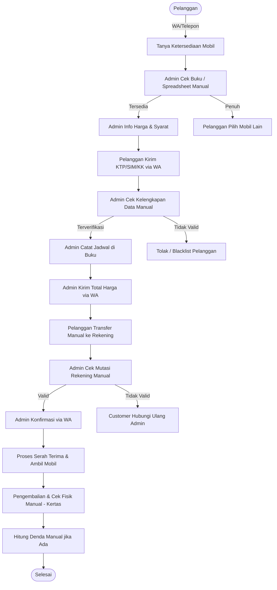
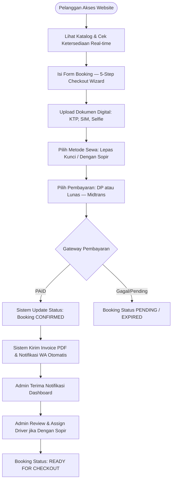
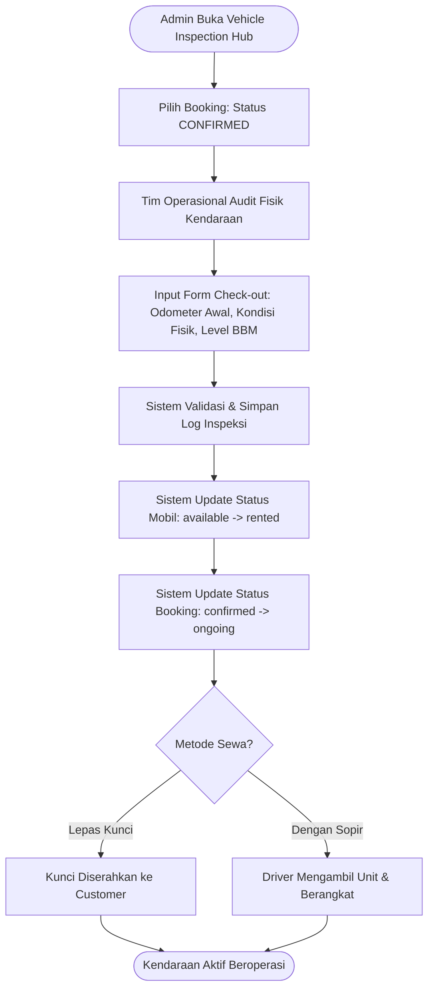
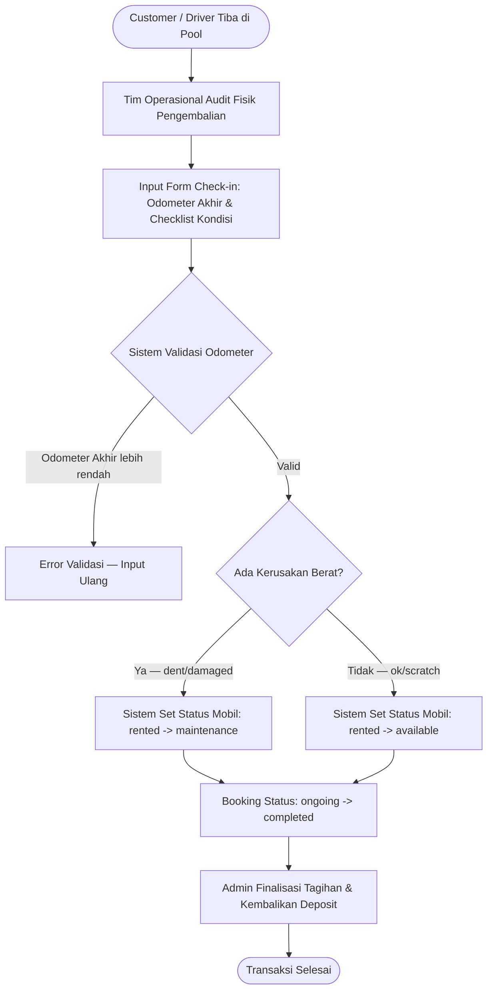
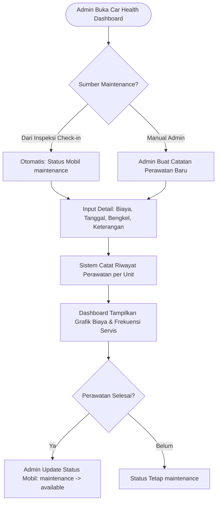
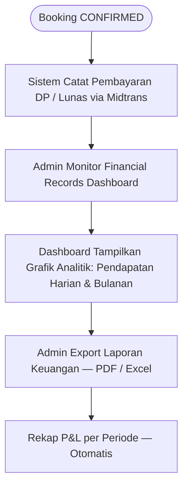
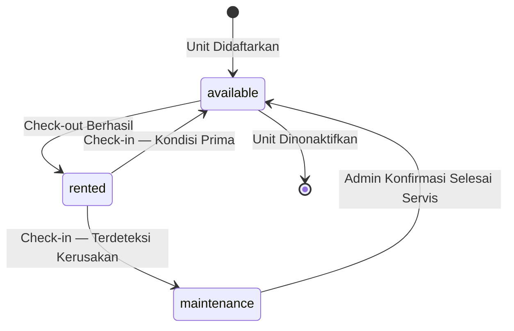

# Analisis Sistem Berjalan — Siliwangi Rental

**Nama File:** `sistem-berjalan.md`
**Lokasi:** `documents/BRD/`
**Tujuan:** Mendokumentasikan prosedur bisnis yang sedang berjalan secara mendetail, mencakup sistem manual lama dan sistem digital yang telah diimplementasikan.

---

## 1. Deskripsi Umum

Siliwangi Rental mengoperasikan bisnis penyewaan kendaraan berbasis di Bandung. Proses operasional melibatkan koordinasi lintas aktor: **Pelanggan**, **Administrator**, **Tim Operasional (Auditor Lapangan)**, **Driver**, dan **Sistem Aplikasi Laravel**.

Sejak versi **v1.0.0**, sistem telah bertransisi dari alur manual berbasis WhatsApp ke platform digital terintegrasi. Per **v1.0.2**, seluruh alur inti (booking, pembayaran, inspeksi, pemeliharaan, dan pelaporan keuangan) telah berjalan secara otomatis dalam satu ekosistem.

---

## 2. Alur Sistem Manual (Sebelum Digitalisasi — Referensi Historis)

Proses ini **sudah tidak digunakan**, namun didokumentasikan sebagai acuan komparasi dan audit bisnis.

### Identifikasi Masalah Sistem Manual

| No  | Kategori                | Kendala                                                                 |
| :-- | :---------------------- | :---------------------------------------------------------------------- |
| 1   | **Koordinasi**          | Perpindahan data antar divisi terlambat karena bergantung pada pesan WA |
| 2   | **Validasi Pembayaran** | Cek mutasi bank manual, rentan keterlambatan dan human error            |
| 3   | **Arsip Inspeksi**      | Form fisik kertas sering hilang, rusak, atau tidak terbaca              |
| 4   | **Transparansi**        | Customer tidak bisa memantau status booking secara mandiri              |
| 5   | **Keamanan Dokumen**    | Pengecekan KTP/SIM hanya visual, rawan pemalsuan                        |
| 6   | **Pelaporan**           | Laporan keuangan dibuat manual di Excel, tidak real-time                |

---

## 3. Alur Sistem Digital yang Saat Ini Berjalan (v1.0.2)

### 3.1 Alur Booking & Pembayaran (Customer → Sistem → Admin)

### 3.2 Alur Inspeksi Check-out (Serah Terima Kendaraan)

### 3.3 Alur Inspeksi Check-in (Pengembalian Kendaraan)

### 3.4 Alur Car Health & Maintenance

### 3.5 Alur Keuangan & Pembayaran

---

## 4. Peta Aktor & Tanggung Jawab (RACI Summary)

| Aktivitas                      | Customer | Admin | Tim Ops | Driver |    Sistem    |
| :----------------------------- | :------: | :---: | :-----: | :----: | :----------: |
| Booking kendaraan              |  **R**   |   I   |    —    |   —    |      A       |
| Upload dokumen identitas       |  **R**   |   I   |    —    |   —    |      A       |
| Konfirmasi & assign driver     |    —     | **R** |    —    |   I    |      A       |
| Audit inspeksi check-out       |    —     |   I   |  **R**  |   —    |      A       |
| Mengemudikan kendaraan (sopir) |    —     |   —   |    —    | **R**  |      I       |
| Audit inspeksi check-in        |    I     |   I   |  **R**  |   —    |      A       |
| Update status kendaraan        |    —     |   —   |    —    |   —    | **R** (auto) |
| Pencatatan maintenance         |    —     | **R** |    —    |   —    |      A       |
| Finalisasi tagihan             |    —     | **R** |    —    |   —    |      A       |
| Laporan keuangan               |    —     | **R** |    —    |   —    |      A       |

> **R** = Responsible (Pelaksana) · **A** = Accountable (Penanggung Jawab Sistem) · **I** = Informed

---

## 5. Status Kendaraan & Transisi (State Machine)

---

## 6. Modul Sistem yang Aktif (v1.0.2)

| Modul                         |     Status     | Keterangan                                 |
| :---------------------------- | :------------: | :----------------------------------------- |
| Katalog & Booking Public      |    ✅ Aktif    | Checkout 5-langkah dengan upload dokumen   |
| Gateway Pembayaran Midtrans   |    ✅ Aktif    | DP dan pelunasan otomatis                  |
| Admin Dashboard (Filament)    |    ✅ Aktif    | Manajemen booking, pelanggan, armada       |
| Vehicle Inspection Hub        |    ✅ Aktif    | Check-out & Check-in dengan audit fisik    |
| Car Health & Maintenance      |    ✅ Aktif    | Grafik biaya & riwayat perawatan per unit  |
| Financial Records & Analytics |    ✅ Aktif    | Grafik pendapatan harian dan bulanan       |
| Live GPS Tracking             | 🚧 Placeholder | Belum terintegrasi dengan perangkat GPS    |
| WhatsApp Notification         | 🚧 Placeholder | Antrean siap, integrasi API WA belum aktif |
| Loyalty Program               |   🔜 Planned   | Direncanakan pada roadmap v1.1.x           |

---

## 7. Referensi Dokumen Terkait

| Dokumen                     | Lokasi                                         |
| :-------------------------- | :--------------------------------------------- |
| Sistem Usulan Digital       | `documents/BRD/sistem-usulan.md`               |
| Business Requirement Design | `documents/BRD/business-requirement-design.md` |
| Flowchart Inspeksi Draw.io  | `documents/flowchart_inspeksi.drawio`          |
| Diagram UML Sistem Berjalan | `documents/UML/sistem berjalan manual.drawio`  |
| ERD Database                | `documents/DATABASE/erd_siliwangi.drawio`      |
| Progress & Changelog        | `documents/BRD/progress.md`                    |

---

**Versi:** 2.0.0 | **Tanggal:** 2026-05-29 | **Update oleh:** Siliwangi Dev Team
