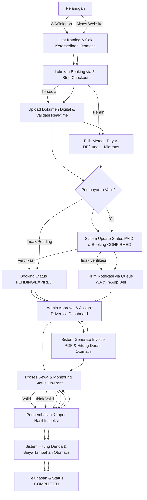

# Analisis Sistem Berjalan (Manual) — Siliwangi Rental

**Nama File:** `sistem-berjalan.md`  
**Lokasi:** `documents/BRD/`  
**Tujuan:** Mendokumentasikan prosedur bisnis yang ada secara mendetail berdasarkan pembagian peran (Swimlane).

---

## 1. Deskripsi Sistem Berjalan

Proses operasional Siliwangi Rental melibatkan koordinasi antara pelanggan, admin marketing, admin operasional, petugas lapangan, dan bagian keuangan. Saat ini, seluruh alur ini masih sangat bergantung pada pencatatan manual dan komunikasi via WhatsApp, yang memiliki risiko human error dan keterlambatan data yang tinggi.

---

## 2. Diagram Alur Sistem Berjalan (Swimlane Flowchart)

---

## 3. Identifikasi Masalah Utama

| No  | Kategori               | Kendala Berdasarkan Alur                                                                         |
| :-- | :--------------------- | :----------------------------------------------------------------------------------------------- |
| 1   | **Koordinasi**         | Perpindahan data dari Marketing ke Operasional sering terlambat (manual).                        |
| 2   | **Validasi**           | Pengecekan mutasi bank oleh Keuangan sering terhambat jika transaksi terjadi di luar jam kantor. |
| 3   | **Fisik & Inventaris** | Form inspeksi fisik kertas sering hilang atau sulit dibaca saat proses pengembalian.             |
| 4   | **Transparansi**       | Customer tidak memiliki akses langsung untuk melihat status booking-nya secara mandiri.          |
| 5   | **Risiko Keamanan**    | Pengecekan data KTP/SIM hanya bersifat visual, rawan dokumen palsu.                              |

---

Versi: 1.2.0 | Tanggal: 2026-05-14
