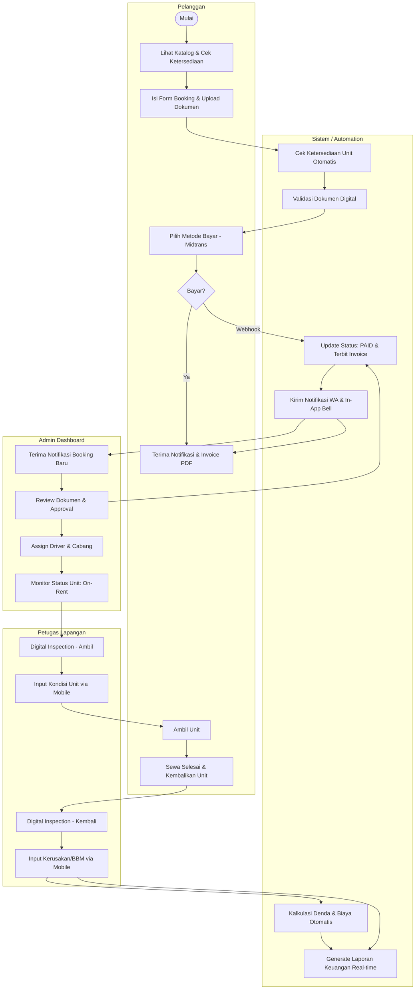

# Analisis Sistem Usulan (Digital) — Siliwangi Rental

**Nama File:** `sistem-usulan.md`  
**Lokasi:** `documents/BRD/`  
**Tujuan:** Mendokumentasikan alur kerja digital yang efisien dan terotomasi.

---

## 1. Deskripsi Sistem Usulan

Sistem digital Siliwangi Rental mengintegrasikan katalog real-time, gateway pembayaran, dan manajemen operasional dalam satu platform. Mayoritas koordinasi data yang sebelumnya manual kini ditangani secara otomatis oleh sistem melalui notifikasi real-time dan antrean pesan.

---

## 2. Diagram Alur Sistem Usulan (Swimlane Flowchart)

---

## 3. Keunggulan Dibandingkan Sistem Manual

| Fitur | Dampak Positif |
|:---|:---|
| **Otomasi Bayar** | Keuangan tidak perlu cek mutasi manual; status update instan via Midtrans. |
| **Pusat Data** | Semua dokumen (KTP/SIM) tersimpan rapi dan aman di database, bukan di chat WA. |
| **Real-time Monitoring** | Admin bisa melihat posisi dan status semua unit (Available, Booked, On-Rent) dalam satu layar. |
| **Notifikasi Cerdas** | Antrean WhatsApp memastikan pesan tetap terkirim meskipun server sedang sibuk. |

---

Versi: 1.2.0 | Tanggal: 2026-05-14
