# ERD — Entity Relationship Diagram

**Nama File:** `ERD.md`  
**Lokasi:** `documents/DATABASE/`  
**Tujuan:** Dokumentasi ERD lengkap sistem Siliwangi Rental dalam format Mermaid dan deskripsi relasi antar entitas yang disederhanakan untuk tingkat Kerja Praktik (KP).

---

## Metadata Dokumen

| Atribut      | Detail                |
| ------------ | --------------------- |
| Nama Project | Siliwangi Rental      |
| Database     | MySQL 8.x / SQLite    |
| ORM          | Eloquent (Laravel 12) |
| Versi        | 5.0.0 (Simplified)    |
| Tanggal      | 2026-05-23            |

---

## 1. ERD Diagram (Mermaid)

```mermaid
erDiagram
    users {
        bigint id PK
        string name
        string email
        string password
        string phone
        string avatar
        string role
        enum status
        timestamp last_login
        timestamp email_verified_at
        timestamp created_at
    }

    customers {
        bigint id PK
        bigint user_id FK
        string name
        string email
        string phone
        string nik
        string sim_number
        string ktp_image
        string sim_image
        string ktp_path
        string sim_path
        string no_kk
        string kk_photo
        string nip_nim
        string id_card_photo
        string pekerjaan
        string customer_status
        text address
        string date_of_birth
        boolean is_active
        timestamp created_at
    }

    employees {
        bigint id PK
        bigint user_id FK
        bigint store_id FK
        string name
        string email
        string phone
        string nip
        string position
        boolean is_active
        timestamp created_at
    }

    stores {
        bigint id PK
        string name
        string slug
        string phone
        string email
        text address
        string city
        string province
        text google_maps
        boolean status
        timestamp created_at
    }

    cars {
        bigint id PK
        bigint store_id FK
        string car_name
        string slug
        string plate_number
        year year
        string color
        integer seat
        enum transmission
        enum fuel_type
        decimal daily_price
        decimal monthly_price
        decimal late_fee
        string thumbnail
        text description
        enum status
        boolean is_available
        boolean featured
        string brand_name
        string brand_slug
        string brand_logo
        string type_name
        text type_description
        json images
        decimal latitude
        decimal longitude
        decimal speed
        string location_address
        json location_raw_data
        json maintenances
        json inspections
        timestamp created_at
    }

    drivers {
        bigint id PK
        bigint user_id FK
        bigint store_id FK
        string name
        string phone
        text address
        string license_number
        string photo
        decimal daily_fee
        decimal rating
        enum status
        boolean is_available
        timestamp created_at
    }

    promos {
        bigint id PK
        string code
        string title
        text description
        enum discount_type
        decimal discount_value
        decimal minimum_transaction
        date start_date
        date end_date
        integer quota
        integer used
        boolean status
        timestamp created_at
    }

    bookings {
        bigint id PK
        string booking_code
        bigint customer_id FK
        bigint car_id FK
        bigint driver_id FK
        bigint store_id FK
        bigint promo_id FK
        enum booking_type
        datetime pickup_date
        datetime return_date
        text pickup_location
        text return_location
        integer total_day
        decimal price
        decimal driver_price
        decimal extra_price
        decimal late_fee
        decimal discount
        decimal tax
        decimal grand_total
        decimal dp_amount
        decimal remaining_payment
        enum payment_status
        enum booking_status
        text notes
        datetime expired_at
        string rental_type
        string guest_token
        string guest_name
        string guest_email
        string guest_phone
        string ktp_path
        string sim_path
        timestamp created_at
    }

    payments {
        bigint id PK
        bigint booking_id FK
        string payment_code
        string payment_method
        string transaction_id
        text snap_token
        decimal gross_amount
        decimal paid_amount
        enum payment_status
        datetime payment_date
        string proof_payment
        json midtrans_response
        json payment_logs
        timestamp created_at
    }

    expenses {
        bigint id PK
        date date
        string category
        bigint store_id FK
        decimal amount
        string description
        string attachment
        timestamp created_at
    }

    reviews {
        bigint id PK
        bigint booking_id FK
        bigint customer_id FK
        bigint car_id FK
        integer rating
        text review
        boolean status
        timestamp created_at
    }

    location_surveys {
        bigint id PK
        bigint store_id FK
        bigint booking_id FK
        string surveyor_name
        date survey_date
        enum survey_type
        text address
        json residence_status
        json job_status
        json neighbor_interview
        json photos
        enum recommendation
        text notes
        enum status
        bigint approved_by FK
        timestamp approved_at
        timestamp created_at
    }

    vehicle_inspections {
        bigint id PK
        bigint store_id FK
        bigint booking_id FK
        bigint car_id FK
        string inspector_name
        enum inspection_type
        timestamp inspected_at
        integer odometer_km
        enum fuel_level
        json exterior
        json interior
        json equipment
        json engine
        json photos
        json fuel_photos
        boolean damage_found
        text damage_description
        decimal damage_cost
        decimal dirty_fine
        decimal fuel_fine
        json damage_photos
        boolean customer_confirmed
        text customer_note
        text notes
        enum status
        timestamp created_at
    }

    users ||--o| customers : "has profile"
    users ||--o| employees : "has profile"
    users ||--o{ drivers : "is driver"
    stores ||--o{ cars : "owns"
    stores ||--o{ drivers : "employs"
    stores ||--o{ employees : "employs"
    stores ||--o{ expenses : "incurs"
    stores ||--o{ location_surveys : "conducts"
    stores ||--o{ vehicle_inspections : "oversees"
    cars ||--o{ bookings : "booked in"
    customers ||--o{ bookings : "makes"
    drivers ||--o{ bookings : "assigned to"
    promos ||--o{ bookings : "applied to"
    bookings ||--o{ payments : "has payments"
    bookings ||--o{ reviews : "reviewed in"
    bookings ||--o{ location_surveys : "surveyed in"
    bookings ||--o{ vehicle_inspections : "inspected in"
    cars ||--o{ vehicle_inspections : "inspected"
```

---

## 2. Deskripsi Relasi Utama

| Relasi                           | Tipe             | Keterangan                                                                                               |
| -------------------------------- | ---------------- | -------------------------------------------------------------------------------------------------------- |
| **User → Customer**              | `1:1 (Optional)` | Akun user terhubung ke detail dokumen kustomer di tabel `customers` jika login sebagai kustomer.         |
| **User → Employee**              | `1:1 (Optional)` | Akun user terhubung ke profil karyawan di tabel `employees` jika karyawan diberikan akses dashboard.     |
| **User → Driver**                | `1:1 (Optional)` | User dengan role `driver` terhubung ke data detail driver di tabel `drivers`.                            |
| **Customer → Booking**           | `1:N`            | Kustomer terdaftar (`customers`) melakukan transaksi pemesanan mobil (`bookings`).                       |
| **Store → Car**                  | `1:N`            | Cabang rental/toko (`stores`) mengelola unit kendaraan (`cars`) yang dialokasikan di sana.               |
| **Store → Employee**             | `1:N`            | Cabang menugaskan/mempekerjakan karyawan (`employees`).                                                  |
| **Store → Driver**               | `1:N`            | Cabang menugaskan pengemudi (`drivers`) untuk transaksi sewa dengan supir.                               |
| **Store → Expense**              | `1:N`            | Cabang mencatat pengeluaran operasional cabang langsung (`expenses`).                                    |
| **Store → Location Survey**      | `1:N`            | Toko cabang mengoordinasikan survei validasi lokasi tempat tinggal kustomer (`location_surveys`).        |
| **Store → Vehicle Inspection**   | `1:N`            | Toko cabang mengawasi proses pengecekan keluar/masuk unit mobil (`vehicle_inspections`).                 |
| **Car → Booking**                | `1:N`            | Satu unit kendaraan dapat dipesan pada banyak transaksi booking berbeda.                                 |
| **Driver → Booking**             | `1:N`            | Pengemudi ditugaskan pada transaksi booking sewa dengan sopir.                                           |
| **Promo → Booking**              | `1:N`            | Kode kupon promo dapat digunakan pada transaksi booking untuk mendapatkan potongan harga.                |
| **Booking → Payment**            | `1:N`            | Satu transaksi booking dapat menerima beberapa transaksi pembayaran (misalnya DP lalu pelunasan).        |
| **Booking → Review**             | `1:1`            | Setiap transaksi booking yang selesai dapat dinilai oleh penyewa dalam bentuk 1 ulasan.                  |
| **Customer → Review**            | `1:N`            | Kustomer memberikan penilaian kepuasan sewa terhadap kendaraan.                                          |
| **Booking → Location Survey**    | `1:N`            | Transaksi pemesanan memicu pembuatan survei validasi kelayakan kustomer (`location_surveys`).            |
| **Booking → Vehicle Inspection** | `1:N`            | Transaksi pemesanan memiliki log pengecekan mobil sebelum sewa dan sesudah sewa (`vehicle_inspections`). |
| **Car → Vehicle Inspection**     | `1:N`            | Armada mobil menerima log inspeksi kelayakan fisik berkala (`vehicle_inspections`).                      |

---

## 3. Catatan Penyederhanaan Akademik (Kerja Praktik)

Untuk mempermudah pelaporan Kerja Praktik dan pemeliharaan sistem, beberapa perubahan penyederhanaan berikut telah diterapkan:

1. **Pemisahan Customer dan Karyawan**: Tabel `customers` memegang detail dokumen rental pelanggan (NIK KTP, SIM, KK, dll.) sedangkan tabel `users` memegang kredensial login dasar (email, password, role) agar database lebih modular dan teratur.
2. **Penghapusan Tabel Jadwal Supir**: Tabel `driver_schedules` dihapus karena jadwal ketersediaan supir bisa secara dinamis dihitung langsung dari tanggal awal dan akhir penyewaan (`start_date` & `end_date`) pada transaksi aktif di tabel `bookings`.
3. **Penyederhanaan Mobil**: Menghapus tracking GPS real-time (latitude, longitude, speed), log servis berkala, dan riwayat inspeksi kompleks berbasis JSON demi menjaga fokus CRUD inti yang mudah dipahami dosen penguji.
4. **Galeri Mobil**: Diganti dengan satu gambar utama (`image`) untuk meminimalkan kompleksitas relasi satu-ke-banyak untuk gambar kendaraan.
