# 📊 Struktur Basis Data — Siliwangi Rental

Dokumen ini berisi dokumentasi teknis lengkap mengenai struktur basis data (database schema), diagram hubungan entitas (Entity Relationship Diagram - ERD), dan penjelasan detail untuk setiap tabel yang digunakan dalam sistem **Siliwangi Rental**.

---

## 📅 Metadata Dokumen

| Atribut               | Detail                    |
| :-------------------- | :------------------------ |
| **Nama Project**      | Siliwangi Rental          |
| **RDBMS**             | MySQL 8.x / SQLite        |
| **ORM / Framework**   | Eloquent ORM (Laravel 12) |
| **Status Database**   | Produksi (Telah Migrasi)  |
| **Tanggal Pembaruan** | 31 Mei 2026               |

---

## 🧬 1. Diagram Hubungan Entitas (ERD)

Berikut adalah visualisasi hubungan antar entitas di dalam sistem Siliwangi Rental menggunakan diagram **Mermaid**. Diagram ini mencakup primary key (PK), foreign key (FK), atribut utama, serta relasi kardinalitas yang efisien dan ramping (Skema 10 Tabel Utama).

```mermaid
erDiagram
    users {
        bigint id PK
        string name
        string email
        string password
        string phone
        string avatar
        string role
        enum status
        timestamp last_login
        timestamp email_verified_at
        timestamp created_at
    }

    customers {
        bigint id PK
        bigint user_id FK
        string name
        string email
        string phone
        string nik
        string sim_number
        string ktp_image
        string sim_image
        string ktp_path
        string sim_path
        string no_kk
        string kk_photo
        string nip_nim
        string id_card_photo
        string pekerjaan
        string customer_status
        text address
        string date_of_birth
        boolean is_active
        timestamp created_at
    }

    stores {
        bigint id PK
        string name
        string slug
        string phone
        string email
        text address
        string city
        string province
        text google_maps
        boolean status
        timestamp created_at
    }

    cars {
        bigint id PK
        bigint store_id FK
        string car_name
        string slug
        string plate_number
        year year
        string color
        integer seat
        enum transmission
        enum fuel_type
        decimal daily_price
        decimal monthly_price
        decimal late_fee
        string thumbnail
        text description
        enum status
        boolean is_available
        boolean featured
        string brand_name
        string brand_slug
        string brand_logo
        string type_name
        text type_description
        json images
        decimal latitude
        decimal longitude
        decimal speed
        string location_address
        json location_raw_data
        json maintenances
        json inspections
        timestamp created_at
    }

    drivers {
        bigint id PK
        bigint user_id FK
        bigint store_id FK
        string name
        string phone
        text address
        string license_number
        string photo
        decimal daily_fee
        decimal rating
        enum status
        boolean is_available
        timestamp created_at
    }

    promos {
        bigint id PK
        string code
        string title
        text description
        enum discount_type
        decimal discount_value
        decimal minimum_transaction
        date start_date
        date end_date
        integer quota
        integer used
        boolean status
        timestamp created_at
    }

    bookings {
        bigint id PK
        string booking_code
        bigint customer_id FK
        bigint car_id FK
        bigint driver_id FK
        bigint store_id FK
        bigint promo_id FK
        enum booking_type
        datetime pickup_date
        datetime return_date
        text pickup_location
        text return_location
        integer total_day
        decimal price
        decimal driver_price
        decimal extra_price
        decimal late_fee
        decimal discount
        decimal tax
        decimal grand_total
        decimal dp_amount
        decimal remaining_payment
        enum payment_status
        enum booking_status
        text notes
        datetime expired_at
        string rental_type
        string guest_token
        string guest_name
        string guest_email
        string guest_phone
        string ktp_path
        string sim_path
        timestamp created_at
    }

    payments {
        bigint id PK
        bigint booking_id FK
        string payment_code
        string payment_method
        string transaction_id
        text snap_token
        decimal gross_amount
        decimal paid_amount
        enum payment_status
        datetime payment_date
        string proof_payment
        json midtrans_response
        json payment_logs
        timestamp created_at
    }

    expenses {
        bigint id PK
        date date
        string category
        bigint store_id FK
        decimal amount
        string description
        string attachment
        timestamp created_at
    }

    reviews {
        bigint id PK
        bigint booking_id FK
        bigint customer_id FK
        bigint car_id FK
        integer rating
        text review
        boolean status
        timestamp created_at
    }

    location_surveys {
        bigint id PK
        bigint store_id FK
        bigint booking_id FK
        string surveyor_name
        date survey_date
        enum survey_type
        text address
        json residence_status
        json job_status
        json neighbor_interview
        json photos
        enum recommendation
        text notes
        enum status
        bigint approved_by FK
        timestamp approved_at
        timestamp created_at
    }

    vehicle_inspections {
        bigint id PK
        bigint store_id FK
        bigint booking_id FK
        bigint car_id FK
        string inspector_name
        enum inspection_type
        timestamp inspected_at
        integer odometer_km
        enum fuel_level
        json exterior
        json interior
        json equipment
        json engine
        json photos
        json fuel_photos
        boolean damage_found
        text damage_description
        decimal damage_cost
        decimal dirty_fine
        decimal fuel_fine
        json damage_photos
        boolean customer_confirmed
        text customer_note
        text notes
        enum status
        timestamp created_at
    }

    users ||--o| customers : "has profile"
    users ||--o{ drivers : "is driver"
    stores ||--o{ cars : "owns"
    stores ||--o{ drivers : "employs"
    stores ||--o{ expenses : "incurs"
    stores ||--o{ location_surveys : "conducts"
    stores ||--o{ vehicle_inspections : "oversees"
    cars ||--o{ bookings : "booked in"
    customers ||--o{ bookings : "makes"
    drivers ||--o{ bookings : "assigned to"
    promos ||--o{ bookings : "applied to"
    bookings ||--o{ payments : "has payments"
    bookings ||--o{ reviews : "reviewed in"
    bookings ||--o{ location_surveys : "surveyed in"
    bookings ||--o{ vehicle_inspections : "inspected in"
    cars ||--o{ vehicle_inspections : "inspected"
```

---

## 🧬 2. Hubungan dan Relasi Antar Tabel

Sistem ini dirancang dengan integritas data menggunakan hubungan kunci asing (Foreign Key). Berikut adalah tabel ringkasan relasi kunci utama sistem:

| Relasi | Tipe | Deskripsi Penjelasan |
| :--- | :--- | :--- |
| **`users` ➔ `customers`** | `1:1 (Optional)` | Pengguna dengan peran customer memiliki relasi satu-ke-satu dengan data profil keanggotaan dan kelengkapan berkas kustomer. |
| **`users` ➔ `drivers`** | `1:1 (Optional)` | Pengguna dengan peran driver memiliki detail data profil keahlian mengemudi. |
| **`customers` ➔ `bookings`** | `1:N (One to Many)` | Kustomer terdaftar (customer) dapat membuat banyak riwayat transaksi pemesanan. |
| **`stores` ➔ `cars`** | `1:N (One to Many)` | Toko cabang rental memiliki/menguasai beberapa armada mobil yang terdaftar di cabang tersebut. |
| **`stores` ➔ `drivers`** | `1:N (One to Many)` | Driver ditugaskan dan bekerja di bawah koordinasi toko cabang tertentu. |
| **`stores` ➔ `expenses`** | `1:N (One to Many)` | Log transaksi pengeluaran dicatat berdasarkan toko cabang yang membiayainya. |
| **`stores` ➔ `location_surveys`** | `1:N (One to Many)` | Toko cabang mengoordinasikan survei validasi lokasi tempat tinggal kustomer. |
| **`stores` ➔ `vehicle_inspections`** | `1:N (One to Many)` | Toko cabang mengawasi proses pengecekan keluar/masuk unit mobil. |
| **`cars` ➔ `bookings`** | `1:N (One to Many)` | Satu unit mobil dapat disewa dalam banyak pemesanan (pada periode berbeda). |
| **`bookings` ➔ `payments`** | `1:N (One to Many)` | Satu pemesanan dapat memiliki beberapa transaksi pembayaran (DP, pelunasan, atau denda). |
| **`bookings` ➔ `reviews`** | `1:1` | Transaksi penyewaan yang selesai dapat diulas sekali oleh kustomer. |
| **`bookings` ➔ `location_surveys`** | `1:N (One to Many)` | Pemesanan memicu pembuatan survei validasi kelayakan kustomer. |
| **`bookings` ➔ `vehicle_inspections`** | `1:N (One to Many)` | Log pengecekan mobil sebelum sewa dan sesudah sewa. |
| **`cars` ➔ `vehicle_inspections`** | `1:N (One to Many)` | Armada mobil menerima log inspeksi kelayakan fisik berkala. |

---

## 📝 3. Penjelasan Detail Setiap Tabel

> [!NOTE]
> Seluruh tabel di bawah menggunakan mesin penyimpanan InnoDB untuk mendukung foreign key constraints, transaksi, dan row-level locking.

### 👥 3.1. Tabel: `users`

Tabel ini menyimpan data kredensial autentikasi dasar untuk seluruh pengguna aplikasi (Super Admin, Admin, Customer, atau Driver).

- **Fungsi:** Menyimpan kredensial masuk, peran (role), dan status keaktifan akun pengguna.

| Nama Atribut | Tipe Data | Panjang | Keterangan |
| :--- | :--- | :--- | :--- |
| id | Bigint Unsigned | - | Primary Key, Auto Increment. ID unik pengguna. |
| name | String | 255 | Nama lengkap pengguna. |
| email | String | 255 | Alamat email unik pengguna (untuk login). |
| password | String | 255 | Hash password keamanan pengguna. |
| phone | String | 20 | Nomor telepon aktif pengguna (nullable, unique). |
| avatar | String | 255 | Path gambar foto profil pengguna (nullable). |
| role | String | 50 | Peran pengguna: `'admin'`, `'customer'`, atau `'driver'`. |
| status | Enum | - | Status keaktifan akun: `'active'`, `'inactive'`. |
| last_login | Timestamp | - | Tanggal dan waktu terakhir login (nullable). |
| email_verified_at | Timestamp | - | Tanggal verifikasi email (nullable). |
| created_at | Timestamp | - | Waktu data dibuat. |

### 📁 3.2. Tabel: `customers`

Tabel terpisah untuk menyimpan informasi detail profil identitas, dokumen legalitas sewa, dan status verifikasi pelanggan (Customer).

- **Fungsi:** Menyimpan data dokumen kustomer (KTP, SIM, KK, dll.) untuk proses verifikasi penyewaan mobil.

| Nama Atribut | Tipe Data | Panjang | Keterangan |
| :--- | :--- | :--- | :--- |
| id | Bigint Unsigned | - | Primary Key, Auto Increment. ID unik profil kustomer. |
| user_id | Bigint Unsigned | - | Foreign Key ke `users.id` (nullable). Terhubung ke akun login user. |
| name | String | 255 | Nama lengkap kustomer. |
| email | String | 255 | Alamat email kustomer (nullable). |
| phone | String | 20 | Nomor telepon aktif kustomer. |
| nik | String | 50 | Nomor Induk Kependudukan (NIK KTP) (nullable). |
| sim_number | String | 50 | Nomor SIM A Pengemudi (nullable). |
| ktp_image | String | 255 | Path upload scan KTP utama (nullable). |
| sim_image | String | 255 | Path upload scan SIM A utama (nullable). |
| ktp_path | String | 255 | Path upload scan KTP pendukung (nullable). |
| sim_path | String | 255 | Path upload scan SIM A pendukung (nullable). |
| no_kk | String | 50 | Nomor Kartu Keluarga (NIK KK) (nullable). |
| kk_photo | String | 255 | Path upload scan Kartu Keluarga (nullable). |
| nip_nim | String | 50 | Nomor Induk Pegawai / Mahasiswa (NIP/NIM) (nullable). |
| id_card_photo | String | 255 | Path upload foto kartu mahasiswa/pegawai (nullable). |
| pekerjaan | String | 100 | Jenis pekerjaan/profesi kustomer (nullable). |
| customer_status | String | 50 | Status verifikasi kustomer: `'pending'`, `'verified'`, `'rejected'`. |
| address | Text | - | Alamat tempat tinggal kustomer (nullable). |
| date_of_birth | String | 50 | Tanggal lahir kustomer (nullable). |
| is_active | Boolean | - | Status keaktifan kustomer: `true` (aktif), `false` (nonaktif). |
| created_at | Timestamp | - | Waktu data dibuat. |

### 🏢 3.3. Tabel: `stores`

Daftar toko / kantor cabang operasional Siliwangi Rental.

- **Fungsi:** Memisahkan data inventaris mobil, supir cabang, pengeluaran operasional, dan pendapatan per outlet toko.

| Nama Atribut | Tipe Data | Panjang | Keterangan |
| :--- | :--- | :--- | :--- |
| id | Bigint Unsigned | - | Primary Key, Auto Increment. ID unik toko cabang. |
| name | String | 255 | Nama toko cabang (misal: "Siliwangi Bandung"). |
| slug | String | 255 | Slug URL unik toko cabang. |
| phone | String | 20 | Nomor telepon operasional toko (nullable). |
| email | String | 255 | Email resmi operasional toko (nullable). |
| address | Text | - | Lokasi fisik alamat kantor cabang (nullable). |
| city | String | 100 | Kota lokasi toko berada (nullable). |
| province | String | 100 | Provinsi lokasi toko berada (nullable). |
| google_maps | Text | - | Embed link peta Google Maps lokasi cabang (nullable). |
| status | Boolean | - | Status keaktifan operasional toko: `true` (aktif), `false` (tutup). |
| created_at | Timestamp | - | Waktu data dibuat. |

### 🚗 3.4. Tabel: `cars`

Tabel armada mobil persewaan yang dikelola secara modular beserta informasi merek, jenis, koordinat GPS, dan log operasional terintegrasi.

- **Fungsi:** Menyimpan data unit kendaraan yang siap disewakan di masing-masing toko cabang.

| Nama Atribut | Tipe Data | Panjang | Keterangan |
| :--- | :--- | :--- | :--- |
| id | Bigint Unsigned | - | Primary Key, Auto Increment. ID unik mobil. |
| store_id | Bigint Unsigned | - | Foreign Key ke `stores.id`. Toko pemilik armada mobil. |
| car_name | String | 255 | Nama lengkap mobil (misal: "Avanza Veloz 1.5"). |
| slug | String | 255 | Slug URL unik kendaraan. |
| plate_number | String | 20 | Nomor polisi/plat kendaraan (unik). |
| year | Year | - | Tahun pembuatan mobil. |
| color | String | 50 | Warna fisik mobil (nullable). |
| seat | Integer | - | Kapasitas jumlah kursi/penumpang. |
| transmission | Enum | - | Transmisi mobil: `'Manual'` atau `'Automatic'`. |
| fuel_type | Enum | - | Jenis bahan bakar: `'Bensin'`, `'Diesel'`, `'Listrik'`. |
| daily_price | Decimal | 15,2 | Tarif sewa harian mobil. |
| monthly_price | Decimal | 15,2 | Tarif sewa bulanan mobil. |
| late_fee | Decimal | 15,2 | Tarif denda keterlambatan pengembalian per jam/hari. |
| thumbnail | String | 255 | Path gambar utama eksterior mobil (nullable). |
| description | Text | - | Catatan deskripsi detail mengenai unit mobil (nullable). |
| status | Enum | - | Status ketersediaan mobil: `'available'`, `'rented'`, `'maintenance'`. |
| is_available | Boolean | - | Flag kesiapan disewa: `true` atau `false`. |
| featured | Boolean | - | Rekomendasi utama di homepage: `true` atau `false`. |
| brand_name | String | 255 | Merek mobil (misal: "Toyota"). |
| brand_slug | String | 255 | Slug unik merek mobil. |
| brand_logo | String | 255 | Path logo merek mobil (nullable). |
| type_name | String | 255 | Nama jenis tipe kategori mobil (misal: "MPV"). |
| type_description | Text | - | Deskripsi tipe kategori mobil (nullable). |
| images | Json | - | Array JSON berisi path galeri foto mobil lainnya (nullable). |
| latitude | Decimal | 10,8 | Titik koordinat lintang GPS mobil (nullable). |
| longitude | Decimal | 11,8 | Titik koordinat bujur GPS mobil (nullable). |
| speed | Decimal | 5,2 | Kecepatan gerak real-time kendaraan (nullable). |
| location_address | String | 255 | Alamat pelacakan lokasi terakhir mobil (nullable). |
| location_raw_data | Json | - | Log data mentah pelacakan koordinat GPS (nullable). |
| maintenances | Json | - | Log log historis servis/pemeliharaan berkala mobil (nullable). |
| inspections | Json | - | Log log historis inspeksi kelayakan fisik mobil (nullable). |
| created_at | Timestamp | - | Waktu data dibuat. |

### 👔 3.5. Tabel: `drivers`

Profil pengemudi profesional mitra Siliwangi Rental.

- **Fungsi:** Menyimpan informasi kelayakan mengemudi driver, rating, tarif tambahan, dan status penugasan.

| Nama Atribut | Tipe Data | Panjang | Keterangan |
| :--- | :--- | :--- | :--- |
| id | Bigint Unsigned | - | Primary Key, Auto Increment. ID unik driver. |
| user_id | Bigint Unsigned | - | Foreign Key ke `users.id` (nullable). Terhubung ke akun user driver. |
| store_id | Bigint Unsigned | - | Foreign Key ke `stores.id`. Cabang penugasan driver bekerja. |
| name | String | 255 | Nama lengkap supir. |
| phone | String | 20 | Nomor telepon aktif supir. |
| address | Text | - | Alamat domisili supir (nullable). |
| license_number | String | 50 | Nomor SIM aktif supir (nullable). |
| photo | String | 255 | Path file foto resmi supir (nullable). |
| daily_fee | Decimal | 15,2 | Tarif jasa pengemudi per hari. |
| rating | Decimal | 3,2 | Rata-rata rating bintang dari pelanggan. |
| status | Enum | - | Status kemitraan supir: `'active'` atau `'inactive'`. |
| is_available | Boolean | - | Kesiapan jalan hari ini: `true` atau `false`. |
| created_at | Timestamp | - | Waktu data dibuat. |

### 🧾 3.6. Tabel: `bookings`

Tabel transaksi penyewaan utama yang mengoordinasikan kustomer, mobil, supir, promo, dan kalkulasi keuangan.

- **Fungsi:** Menyimpan detail sewa kendaraan, durasi sewa, rincian biaya, status pesanan, dan berkas checkout tamu (guest checkout).

| Nama Atribut | Tipe Data | Panjang | Keterangan |
| :--- | :--- | :--- | :--- |
| id | Bigint Unsigned | - | Primary Key, Auto Increment. ID unik pesanan. |
| booking_code | String | 100 | Kode pesanan sewa unik acak (SLW-xxxx). |
| customer_id | Bigint Unsigned | - | Foreign Key ke `customers.id`. Kustomer penyewa. |
| car_id | Bigint Unsigned | - | Foreign Key ke `cars.id`. Armada mobil yang disewa. |
| driver_id | Bigint Unsigned | - | Foreign Key ke `drivers.id` (nullable, diisi jika dengan driver). |
| store_id | Bigint Unsigned | - | Foreign Key ke `stores.id`. Toko asal penyewaan. |
| promo_id | Bigint Unsigned | - | Foreign Key ke `promos.id` (nullable, diisi jika memakai promo). |
| booking_type | Enum | - | Tipe durasi booking sewa: `'daily'` atau `'monthly'`. |
| pickup_date | Datetime | - | Tanggal serah terima mobil dilakukan. |
| return_date | Datetime | - | Tanggal rencana pengembalian mobil. |
| pickup_location | Text | - | Alamat tempat penjemputan/serah terima mobil (nullable). |
| return_location | Text | - | Alamat rencana pengembalian mobil (nullable). |
| total_day | Integer | - | Durasi sewa mobil dalam satuan hari. |
| price | Decimal | 15,2 | Tarif dasar sewa mobil (durasi x harga harian/bulanan). |
| driver_price | Decimal | 15,2 | Tarif total jasa supir yang dikenakan (nullable). |
| extra_price | Decimal | 15,2 | Biaya operasional tambahan/antar-jemput (nullable). |
| late_fee | Decimal | 15,2 | Denda keterlambatan pengembalian aktual. |
| discount | Decimal | 15,2 | Nominal pemotongan harga sewa dari promo (nullable). |
| tax | Decimal | 15,2 | Pajak pertambahan nilai (PPN) transaksi. |
| grand_total | Decimal | 15,2 | Total tagihan akhir transaksi penyewaan. |
| dp_amount | Decimal | 15,2 | Pembayaran uang muka (Down Payment). |
| remaining_payment | Decimal | 15,2 | Sisa tagihan pelunasan sewa. |
| payment_status | Enum | - | Status bayar: `'unpaid'`, `'partial'`, `'paid'`, `'refunded'`. |
| booking_status | Enum | - | Status transaksi sewa: `'pending'`, `'confirmed'`, `'ongoing'`, `'completed'`, `'cancelled'`, `'expired'`. |
| notes | Text | - | Catatan khusus dari kustomer (nullable). |
| expired_at | Datetime | - | Batas waktu pembayaran sebelum dibatalkan otomatis. |
| rental_type | String | 20 | Kategori jenis sewa: `'daily'` atau `'monthly'`. |
| guest_token | String | 100 | Token checkout untuk kustomer non-akun/tamu (nullable). |
| guest_name | String | 255 | Nama kustomer tamu checkout (nullable). |
| guest_email | String | 255 | Email kustomer tamu checkout (nullable). |
| guest_phone | String | 20 | Telepon kustomer tamu checkout (nullable). |
| ktp_path | String | 255 | Path upload KTP customer tamu (nullable). |
| sim_path | String | 255 | Path upload SIM A customer tamu (nullable). |
| created_at | Timestamp | - | Waktu data dibuat. |

### 💳 3.7. Tabel: `payments`

Pencatatan rincian riwayat transaksi pembayaran terintegrasi penuh.

- **Fungsi:** Menghubungkan transaksi pembayaran aplikasi dengan respon gateway Midtrans Snap dan log callback pembayaran.

| Nama Atribut | Tipe Data | Panjang | Keterangan |
| :--- | :--- | :--- | :--- |
| id | Bigint Unsigned | - | Primary Key, Auto Increment. |
| booking_id | Bigint Unsigned | - | Foreign Key ke `bookings.id`. |
| payment_code | String | 100 | Kode unik pembayaran sistem (PAY-xxxx). |
| payment_method | String | 50 | Metode pembayaran (misal: bank_transfer, qris, gopay). |
| transaction_id | String | 255 | ID transaksi unik dari server Midtrans (nullable). |
| snap_token | Text | - | Token transaksi SNAP Midtrans untuk popup modal sewa (nullable). |
| gross_amount | Decimal | 15,2 | Jumlah nominal kotor terproses dari transaksi. |
| paid_amount | Decimal | 15,2 | Jumlah nominal bersih yang sukses dibayarkan. |
| payment_status | Enum | - | Status bayar: `'pending'`, `'success'`, `'failed'`, `'expired'`, `'refund'`. |
| payment_date | Datetime | - | Tanggal sukses transaksi bayar (nullable). |
| proof_payment | String | 255 | Path lokasi bukti upload transfer manual oleh customer (nullable). |
| midtrans_response | Json | - | Respon JSON asli lengkap teranyar dari server Midtrans (nullable). |
| payment_logs | Json | - | Log riwayat callback/webhook dari Midtrans (array of objects). |
| created_at | Timestamp | - | Waktu data dibuat. |

### 🎫 3.8. Tabel: `promos`

Manajemen kupon potongan harga sewa.

- **Fungsi:** Menyimpan aturan diskon sewa bagi customer.

| Nama Atribut | Tipe Data | Panjang | Keterangan |
| :--- | :--- | :--- | :--- |
| id | Bigint Unsigned | - | Primary Key, Auto Increment. |
| code | String | 50 | Kode kupon promo unik (misal: "SILIVAGANZA"). |
| title | String | 255 | Nama/Judul penawaran promo. |
| description | Text | - | Keterangan lengkap mengenai kupon sewa (nullable). |
| discount_type | Enum | - | Jenis potongan: `'percentage'` (persentase) atau `'fixed'` (nominal tetap). |
| discount_value | Decimal | 15,2 | Nilai persentase diskon atau nominal tetap potongan. |
| minimum_transaction | Decimal | 15,2 | Jumlah minimal harga sewa untuk klaim kupon. |
| start_date | Date | - | Tanggal awal promo dapat digunakan. |
| end_date | Date | - | Tanggal akhir promo kedaluwarsa. |
| quota | Integer | - | Batas kuota penggunaan maksimal promo. |
| used | Integer | - | Jumlah klaim promo yang sudah terpakai. |
| status | Boolean | - | Status keaktifan kupon: `true` (aktif) atau `false` (nonaktif). |
| created_at | Timestamp | - | Waktu data dibuat. |

### 📊 3.9. Tabel: `expenses`

Log pencatatan pengeluaran operasional toko.

- **Fungsi:** Mencatat pengeluaran langsung kantor cabang / toko non-servis mobil (gaji, utilitas, dll.).

| Nama Atribut | Tipe Data | Panjang | Keterangan |
| :--- | :--- | :--- | :--- |
| id | Bigint Unsigned | - | Primary Key, Auto Increment. |
| date | Date | - | Tanggal transaksi pengeluaran dilakukan. |
| category | String | 100 | Kategori pengeluaran langsung (Listrik/Air, Gaji, dll.). |
| store_id | Bigint Unsigned | - | Foreign Key ke `stores.id`. Cabang toko yang membiayai pengeluaran. |
| amount | Decimal | 15,2 | Total nominal pengeluaran. |
| description | String | 255 | Keterangan alasan pengeluaran (nullable). |
| attachment | String | 255 | Path upload file lampiran nota/bukti kuitansi (nullable). |
| created_at | Timestamp | - | Waktu data dibuat. |

### ⭐ 3.10. Tabel: `reviews`

Ulasan dan bintang penilaian kepuasan sewa mobil.

- **Fungsi:** Menampilkan bintang rating kepuasan pelanggan terhadap mobil setelah rental selesai.

| Nama Atribut | Tipe Data | Panjang | Keterangan |
| :--- | :--- | :--- | :--- |
| id | Bigint Unsigned | - | Primary Key, Auto Increment. |
| booking_id | Bigint Unsigned | - | Foreign Key ke `bookings.id`. |
| customer_id | Bigint Unsigned | - | Foreign Key ke `customers.id`. Customer pengulas. |
| car_id | Bigint Unsigned | - | Foreign Key ke `cars.id`. Unit mobil yang dinilai. |
| rating | Integer | - | Skala ulasan nilai kepuasan customer (1-5). |
| review | Text | - | Komentar tertulis tanggapan ulasan kustomer (nullable). |
| status | Boolean | - | Status moderasi ulasan: `true` (tampil), `false` (disembunyikan). |
| created_at | Timestamp | - | Waktu data dibuat. |

### 🏠 3.11. Tabel: `location_surveys`

Tabel penugasan survei kelayakan kustomer melalui validasi data tempat tinggal, pekerjaan, dan wawancara lingkungan (RT/RW/tetangga) oleh tim operasional (surveyor).

- **Fungsi:** Menyimpan data checklist validitas kustomer guna menentukan kelayakan sewa (jika tidak layak, customer diblacklist otomatis).

| Nama Atribut | Tipe Data | Panjang | Keterangan |
| :--- | :--- | :--- | :--- |
| id | Bigint Unsigned | - | Primary Key, Auto Increment. |
| store_id | Bigint Unsigned | - | Foreign Key ke `stores.id`. Cabang outlet penanggung jawab. |
| booking_id | Bigint Unsigned | - | Foreign Key ke `bookings.id`. Transaksi booking kustomer terkait. |
| surveyor_name | String | 255 | Nama petugas surveyor dari tim operasional. |
| survey_date | Date | - | Tanggal pelaksanaan kegiatan survei ke lokasi. |
| survey_type | Enum | - | Tipe penyerahan kendaraan: `'delivery'` (diantar) atau `'pickup'` (diambil kustomer). |
| address | Text | - | Alamat lengkap lokasi rumah kustomer yang disurvei. |
| residence_status | Json | - | Status rumah (Rumah Sendiri/Sewa/Kost/Milik Orang Tua) dan bukti kepemilikan. |
| job_status | Json | - | Keterangan status pekerjaan kustomer (Wiraswasta/Karyawan/Kontrak/PNS) beserta nama kantor/usaha. |
| neighbor_interview | Json | - | Catatan wawancara singkat dengan tetangga/RT/RW untuk verifikasi karakter kustomer. |
| photos | Json | - | Kumpulan path URL foto dokumentasi bukti pelaksanaan survei lokasi kustomer. |
| recommendation | Enum | - | Rekomendasi kelayakan surveyor: `'layak'` atau `'tidak_layak'`. |
| notes | Text | - | Catatan tambahan pelaksanaan survei (nullable). |
| status | Enum | - | Status keputusan admin: `'pending'`, `'approved'`, `'rejected'`. |
| approved_by | Bigint Unsigned | - | Foreign Key ke `users.id` (nullable). Admin yang mengevaluasi dan menyetujui survei. |
| approved_at | Timestamp | - | Tanggal persetujuan admin (nullable). |
| created_at | Timestamp | - | Waktu data dibuat. |

### 🚗 3.12. Tabel: `vehicle_inspections`

Tabel pencatatan inspeksi fisik kelayakan unit kendaraan sebelum diserahkan ke kustomer (pre_rental) atau setelah dikembalikan dari kustomer (post_rental) oleh petugas inspektur.

- **Fungsi:** Menyimpan checklist detail bodi luar, interior, kelengkapan surat/alat darurat, bensin, dan denda fisik terpisah jika terjadi kerusakan/kekurangan.

| Nama Atribut | Tipe Data | Panjang | Keterangan |
| :--- | :--- | :--- | :--- |
| id | Bigint Unsigned | - | Primary Key, Auto Increment. |
| store_id | Bigint Unsigned | - | Foreign Key ke `stores.id`. Cabang outlet penanggung jawab unit mobil. |
| booking_id | Bigint Unsigned | - | Foreign Key ke `bookings.id`. Transaksi sewa rental mobil terkait. |
| car_id | Bigint Unsigned | - | Foreign Key ke `cars.id`. Armada unit mobil yang diinspeksi. |
| inspector_name | String | 255 | Nama petugas inspektur dari tim operasional. |
| inspection_type | Enum | - | Tipe pengecekan sewa: `'pre_rental'` (keluar) atau `'post_rental'` (kembali). |
| inspected_at | Timestamp | - | Tanggal dan waktu inspeksi fisik selesai dilakukan. |
| odometer_km | Integer | - | Jarak kilometer yang tertera pada odometer dasbor mobil. |
| fuel_level | Enum | - | Level tangki BBM bensin: `'full'`, `'three_quarter'`, `'half'`, `'quarter'`, `'empty'`. |
| exterior | Json | - | Checklist kondisi eksterior (bodi luar, ban, lampu, kaca) beserta catatan detail. |
| interior | Json | - | Checklist kondisi interior (kursi, dasbor, AC, kemudi, audio) beserta catatan detail. |
| equipment | Json | - | Checklist kelengkapan bawaan mobil (Ban serep, STNK asli, kunci roda, segitiga pengaman, dongkrak). |
| engine | Json | - | Checklist kondisi mekanis mesin, oli, air radiator, aki, fungsionalitas rem. |
| photos | Json | - | Kumpulan path URL foto visual kondisi umum mobil serah terima. |
| fuel_photos | Json | - | Kumpulan path URL foto visual indikator bensin/bahan bakar dasbor. |
| damage_found | Boolean | - | Indikasi temuan kerusakan baru selama masa sewa (`true`/`false`). |
| damage_description | Text | - | Deskripsi detail lokasi dan jenis temuan kerusakan baru (nullable). |
| damage_cost | Decimal | 15,2 | Biaya denda ganti rugi kerusakan fisik mobil yang ditagihkan terpisah ke penyewa. |
| dirty_fine | Decimal | 15,2 | Denda cuci mobil jika mobil dikembalikan dalam keadaan kotor/bau rokok terpisah. |
| fuel_fine | Decimal | 15,2 | Denda BBM bensin jika level bensin berkurang dari kondisi awal sewa terpisah. |
| damage_photos | Json | - | Kumpulan path URL foto visual detail kerusakan baru yang ditemukan (nullable). |
| customer_confirmed | Boolean | - | Status konfirmasi persetujuan dari kustomer sewa (`true`/`false`). |
| customer_note | Text | - | Catatan / keluhan / feedback dari kustomer saat proses serah terima (nullable). |
| notes | Text | - | Catatan umum inspektur terkait kelayakan unit (nullable). |
| status | Enum | - | Status persetujuan pengecekan admin: `'pending'`, `'approved'`. |
| created_at | Timestamp | - | Waktu data dibuat. |
