# Relation Diagram — Siliwangi Rental

**Nama File:** `relation-diagram.md`  
**Lokasi:** `documents/DATABASE/`  
**Tujuan:** Mendokumentasikan diagram relasi antar tabel dalam format deskriptif, detail Eloquent, dan diagram visual Mermaid yang akurat sesuai dengan schema database riil.

---

## 1. Relasi Eloquent (Laravel)

Setiap model dalam direktori `app/Models` terhubung satu sama lain menggunakan ORM Eloquent. Berikut adalah pemetaan relasi lengkap dan akurat setelah penyelarasan arsitektur database (Skema 10 Tabel Utama):

### User Model

Model `User` merepresentasikan pengguna sistem (Super Admin, Admin, Customer, atau Driver).

- `hasOne` ➔ `Customer` `(customers.user_id = users.id)` [Nullable]
- `hasOne` ➔ `Driver` `(drivers.user_id = users.id)` [Nullable]
- `belongsTo` ➔ `Store` `(users.store_id = stores.id)` [Nullable, untuk penugasan staff toko]

### Customer Model

Model `Customer` menyimpan informasi identitas lengkap pelanggan, dokumen rental, dan status keanggotaan.

- `belongsTo` ➔ `User` `(customers.user_id = users.id)` [Nullable]
- `hasMany` ➔ `Booking` `(bookings.customer_id = customers.id)`
- `hasMany` ➔ `Review` `(reviews.customer_id = customers.id)`

### Store Model

Model `Store` mewakili outlet / toko kantor cabang operasional persewaan.

- `hasMany` ➔ `Car` `(cars.store_id = stores.id)`
- `hasMany` ➔ `Driver` `(drivers.store_id = stores.id)`
- `hasMany` ➔ `Booking` `(bookings.store_id = stores.id)`
- `hasMany` ➔ `Expense` `(expenses.store_id = stores.id)`

### Car Model

Model `Car` mewakili unit armada mobil yang tersedia untuk disewa.

- `belongsTo` ➔ `Store` `(cars.store_id = stores.id)`
- `hasMany` ➔ `Booking` `(bookings.car_id = cars.id)`
- `hasMany` ➔ `Review` `(reviews.car_id = cars.id)`

### Driver Model

Model `Driver` menyimpan data pengemudi yang dapat disewa beserta tarif harian dan rating.

- `belongsTo` ➔ `User` `(drivers.user_id = users.id)` [Nullable]
- `belongsTo` ➔ `Store` `(drivers.store_id = stores.id)`
- `hasMany` ➔ `Booking` `(bookings.driver_id = drivers.id)` [Nullable]

### Promo Model

Model kupon promo pemotongan harga sewa.

- `hasMany` ➔ `Booking` `(bookings.promo_id = promos.id)` [Nullable]

### Booking Model

Model utama transaksi persewaan mobil.

- `belongsTo` ➔ `Customer` `(bookings.customer_id = customers.id)`
- `belongsTo` ➔ `Car` `(bookings.car_id = cars.id)`
- `belongsTo` ➔ `Driver` `(bookings.driver_id = drivers.id)` [Nullable]
- `belongsTo` ➔ `Store` `(bookings.store_id = stores.id)`
- `belongsTo` ➔ `Promo` `(bookings.promo_id = promos.id)` [Nullable]
- `hasMany` ➔ `Payment` `(payments.booking_id = bookings.id)`
- `hasOne` ➔ `Review` `(reviews.booking_id = bookings.id)`

### Payment Model

Model transaksi pembayaran tagihan booking (termasuk integrasi Midtrans). Log webhook Midtrans disisipkan langsung sebagai format JSON di kolom `payment_logs`.

- `belongsTo` ➔ `Booking` `(payments.booking_id = bookings.id)`

### Expense Model

Pencatatan pengeluaran operasional outlet / toko cabang.

- `belongsTo` ➔ `Store` `(expenses.store_id = stores.id)`

### Review Model

Review dan rating mobil yang diberikan oleh pelanggan setelah selesai sewa.

- `belongsTo` ➔ `Booking` `(reviews.booking_id = bookings.id)`
- `belongsTo` ➔ `Customer` `(reviews.customer_id = customers.id)`
- `belongsTo` ➔ `Car` `(reviews.car_id = cars.id)`

---

## 2. Mermaid Entity Relationship Diagram (ERD)

```mermaid
erDiagram
    users {
        bigint id PK
        string name
        string email
        string password
        string phone
        string avatar
        string role
        enum status
        timestamp last_login
        timestamp email_verified_at
        timestamp created_at
    }

    customers {
        bigint id PK
        bigint user_id FK
        string name
        string email
        string phone
        string nik
        string sim_number
        string ktp_image
        string sim_image
        string ktp_path
        string sim_path
        string no_kk
        string kk_photo
        string nip_nim
        string id_card_photo
        string pekerjaan
        string customer_status
        text address
        string date_of_birth
        boolean is_active
        timestamp created_at
    }

    stores {
        bigint id PK
        string name
        string slug
        string phone
        string email
        text address
        string city
        string province
        text google_maps
        boolean status
        timestamp created_at
    }

    cars {
        bigint id PK
        bigint store_id FK
        string car_name
        string slug
        string plate_number
        year year
        string color
        integer seat
        enum transmission
        enum fuel_type
        decimal daily_price
        decimal monthly_price
        decimal late_fee
        string thumbnail
        text description
        enum status
        boolean is_available
        boolean featured
        string brand_name
        string brand_slug
        string brand_logo
        string type_name
        text type_description
        json images
        decimal latitude
        decimal longitude
        decimal speed
        string location_address
        json location_raw_data
        json maintenances
        json inspections
        timestamp created_at
    }

    drivers {
        bigint id PK
        bigint user_id FK
        bigint store_id FK
        string name
        string phone
        text address
        string license_number
        string photo
        decimal daily_fee
        decimal rating
        enum status
        boolean is_available
        timestamp created_at
    }

    promos {
        bigint id PK
        string code
        string title
        text description
        enum discount_type
        decimal discount_value
        decimal minimum_transaction
        date start_date
        date end_date
        integer quota
        integer used
        boolean status
        timestamp created_at
    }

    bookings {
        bigint id PK
        string booking_code
        bigint customer_id FK
        bigint car_id FK
        bigint driver_id FK
        bigint store_id FK
        bigint promo_id FK
        enum booking_type
        datetime pickup_date
        datetime return_date
        text pickup_location
        text return_location
        integer total_day
        decimal price
        decimal driver_price
        decimal extra_price
        decimal late_fee
        decimal discount
        decimal tax
        decimal grand_total
        decimal dp_amount
        decimal remaining_payment
        enum payment_status
        enum booking_status
        text notes
        datetime expired_at
        string rental_type
        string guest_token
        string guest_name
        string guest_email
        string guest_phone
        string ktp_path
        string sim_path
        timestamp created_at
    }

    payments {
        bigint id PK
        bigint booking_id FK
        string payment_code
        string payment_method
        string transaction_id
        text snap_token
        decimal gross_amount
        decimal paid_amount
        enum payment_status
        datetime payment_date
        string proof_payment
        json midtrans_response
        json payment_logs
        timestamp created_at
    }

    expenses {
        bigint id PK
        date date
        string category
        bigint store_id FK
        decimal amount
        string description
        string attachment
        timestamp created_at
    }

    reviews {
        bigint id PK
        bigint booking_id FK
        bigint customer_id FK
        bigint car_id FK
        integer rating
        text review
        boolean status
        timestamp created_at
    }

    users ||--o| customers : "has profile"
    users ||--o{ drivers : "is driver"
    stores ||--o{ cars : "owns"
    stores ||--o{ drivers : "employs"
    stores ||--o{ expenses : "incurs"
    cars ||--o{ bookings : "booked in"
    customers ||--o{ bookings : "makes"
    drivers ||--o{ bookings : "assigned to"
    promos ||--o{ bookings : "applied to"
    bookings ||--o{ payments : "has payments"
    bookings ||--o{ reviews : "reviewed in"
```

---

## 3. Aturan Cascade & Null (Foreign Keys Constraints)

Aturan cascading ini secara eksplisit dikonfigurasi pada file migration Laravel untuk menjaga integritas data relasional saat terjadi operasi `DELETE` pada baris data induk:

| Nama Tabel / Kolom Foreign Key | Target Referensi Induk  | ON DELETE Behavior | Alasan & Dampak Bisnis |
| :----------------------------- | :---------------------- | :----------------- | :--------------------- |
| `customers.user_id`            | `users.id`              | **SET NULL**       | Jika akun login pengguna dihapus, berkas fisik dokumen penyewa tetap tersimpan secara historis. |
| `drivers.user_id`              | `users.id`              | **SET NULL**       | Jika akun login driver dihapus, profil kemitraan supir tetap tersimpan secara historis. |
| `drivers.store_id`             | `stores.id`             | **CASCADE**        | Jika toko cabang dihapus, semua driver terkait di bawah cabang tersebut otomatis dihapus. |
| `cars.store_id`                | `stores.id`             | **CASCADE**        | Jika toko cabang dihapus permanen, unit mobil di bawah cabang tersebut otomatis terhapus dari sistem. |
| `bookings.customer_id`         | `customers.id`          | **CASCADE**        | Penghapusan profil pelanggan akan ikut membersihkan riwayat pesanannya demi integritas data. |
| `bookings.car_id`              | `cars.id`               | **CASCADE**        | Jika armada mobil dihapus permanen, riwayat sewa mobil tersebut ikut dibersihkan. |
| `bookings.driver_id`           | `drivers.id`            | **SET NULL**       | Jika data supir dihapus, transaksi booking tetap ada dengan status supir diset menjadi `null` (dianggap lepas kunci). |
| `bookings.store_id`            | `stores.id`             | **CASCADE**        | Jika toko cabang dihapus, transaksi booking terkait otomatis terhapus demi kebersihan data finansial. |
| `bookings.promo_id`            | `promos.id`             | **SET NULL**       | Jika kode promo dinonaktifkan/dihapus, transaksi booking yang sudah berjalan tidak terpengaruh (tetap menyimpan diskon historis). |
| `payments.booking_id`          | `bookings.id`           | **CASCADE**        | Penghapusan transaksi sewa (booking) otomatis menghapus tagihan dan riwayat pembayaran terkait. |
| `reviews.booking_id`           | `bookings.id`           | **CASCADE**        | Jika transaksi booking dihapus, ulasan yang berkaitan otomatis ikut terhapus. |
| `reviews.customer_id`          | `customers.id`          | **CASCADE**        | Ulasan otomatis dihapus jika profil customer yang memberikan ulasan dihapus. |
| `reviews.car_id`               | `cars.id`               | **CASCADE**        | Ulasan otomatis terhapus jika armada mobil yang bersangkutan dihapus dari database. |
| `expenses.store_id`            | `stores.id`             | **CASCADE**        | Pengeluaran keuangan toko cabang otomatis terhapus jika toko tersebut dihapus. |

---

Versi: 5.0.0 | Diperbarui Tanggal: 23 Mei 2026 | Penyelarasan Penuh dengan Skema Akademik Kerja Praktik
