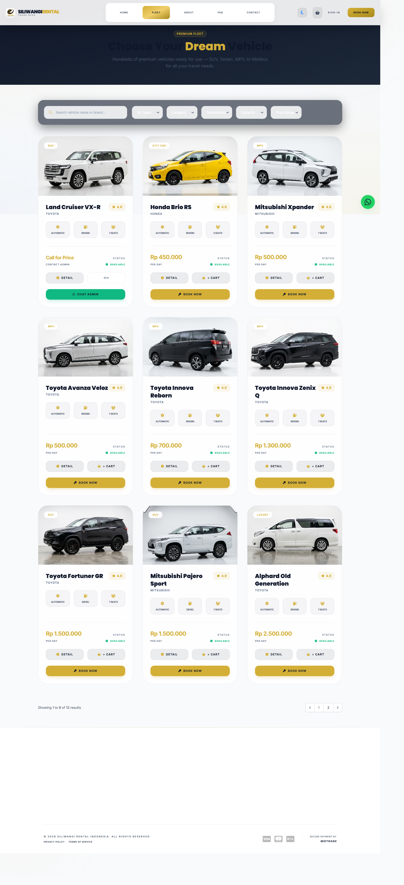

# Implementasi Antarmuka Pengguna - Halaman 1
# Sistem Website Rental Mobil Siliwangi Rental

---

## C. Implementasi Antarmuka Pengguna (Screenshot Aplikasi Riil)

---

### a) Halaman Katalog Kendaraan (Customer)

**Gambar 4.1 Halaman Katalog Kendaraan Pelanggan**

Pada halaman ini, pelanggan dapat melihat daftar kendaraan yang tersedia, lengkap dengan spesifikasi kapasitas penumpang, jenis transmisi (Automatic/Manual), tipe bahan bakar, harga sewa per hari, serta status ketersediaan armada (Available/Rented). Halaman ini dilengkapi dengan fitur pencarian nama kendaraan secara real-time, filter berdasarkan kategori (SUV, City Car, MPV, Luxury), filter kapasitas kursi, serta filter jenis transmisi untuk memudahkan pelanggan menemukan unit yang sesuai dengan kebutuhan perjalanannya. Setiap kartu kendaraan menyediakan dua tombol aksi utama, yaitu **Detail** untuk melihat informasi lengkap unit beserta ulasan pengguna sebelumnya, dan **Book Now** untuk langsung memulai proses pemesanan.
