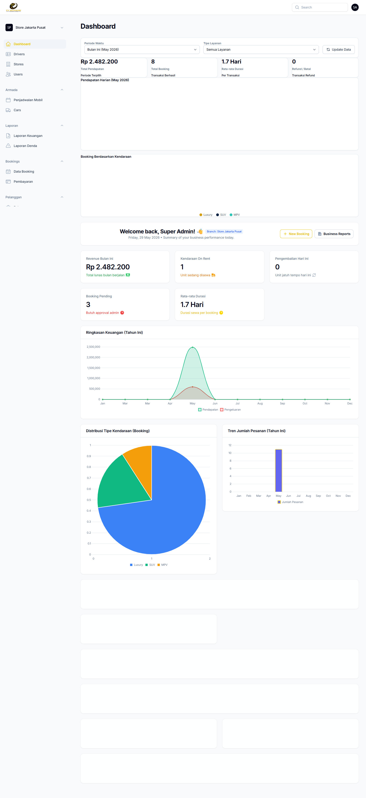

# Implementasi Antarmuka Pengguna - Halaman 2
# Sistem Website Rental Mobil Siliwangi Rental

---

## C. Implementasi Antarmuka Pengguna (Screenshot Aplikasi Riil)

---

### b) Halaman Panel Administrasi & Dashboard Utama (Admin)

**Gambar 4.2 Halaman Dashboard Utama Staf Administrasi**

Halaman ini merupakan pusat kendali (control center) bagi staf toko untuk mengelola seluruh operasional bisnis penyewaan secara terpadu dan real-time. Panel administrasi ini dibangun menggunakan framework **Filament v4** di atas **Laravel 12** dan dilengkapi dengan beberapa modul utama, antara lain:

- **Kartu Metrik KPI (Key Performance Indicators):** Menampilkan ringkasan pendapatan bulan berjalan sebesar **Rp 2.482.200**, jumlah total transaksi berhasil (**8 Booking**), rata-rata durasi sewa (**1.7 Hari per transaksi**), serta jumlah transaksi refund/batal (**0 Transaksi**).
- **Kartu Status Real-Time:** Memperlihatkan jumlah kendaraan yang sedang aktif disewa (On Rent), total booking yang menunggu persetujuan admin (Pending), serta notifikasi pengembalian yang jatuh tempo hari ini.
- **Grafik Ringkasan Keuangan Tahunan:** Visualisasi area chart interaktif yang membandingkan kurva pendapatan dan pengeluaran operasional sepanjang tahun berjalan.
- **Grafik Distribusi Tipe Kendaraan:** Pie chart interaktif yang menampilkan proporsi pemesanan berdasarkan kategori armada (Luxury, SUV, MPV) untuk analisis segmentasi pasar.
- **Grafik Tren Jumlah Pesanan Tahunan:** Bar chart yang menampilkan volume transaksi pemesanan per bulan untuk mengidentifikasi pola musiman dan puncak permintaan.
- **Navigasi Sidebar Multi-Modul:** Akses cepat ke seluruh modul manajemen termasuk Data Booking, Pembayaran, Cars (Armada), Drivers, Stores, Laporan Keuangan, Laporan Denda, dan User Management.
