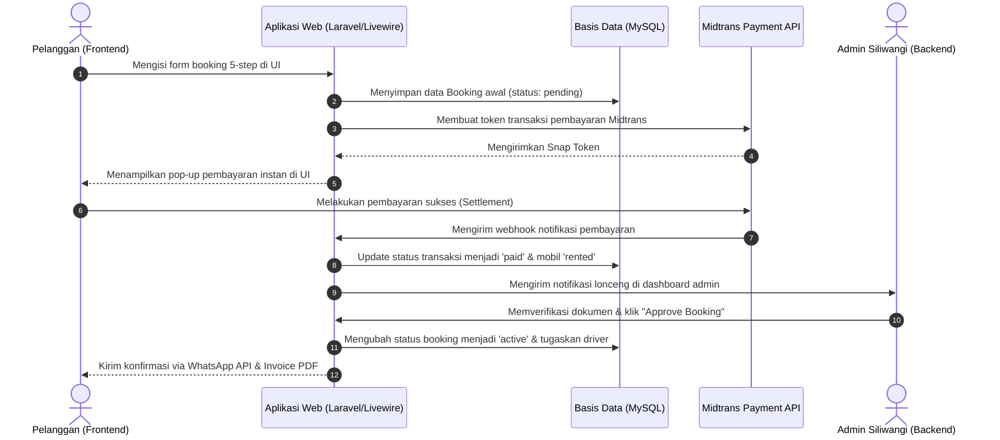

# Spesifikasi Wireframe Low-to-High Fidelity — Siliwangi Rental

**Nama File:** `wireframe-specifications.md`  
**Lokasi:** `C:\laragon\www\rental_project\documents\UIUX\`  
**Tujuan:** Panduan dan dokumentasi rancangan antarmuka (wireframe) dari low hingga high fidelity untuk mendukung pembuatan laporan Kerja Praktek (KP) pada sistem Website Rental Mobil Siliwangi Rental.

---

## 1. Filosofi Desain & Spesifikasi Teknis

Sistem Siliwangi Rental dirancang dengan pendekatan **Modern Premium UX** yang berfokus pada kecepatan transaksi (conversion-oriented), keamanan data, dan fleksibilitas akses (responsive design).

### 1.1 Prinsip Desain

- **Modern Glassmorphism:** Memanfaatkan efek transparansi blur yang halus dengan border tipis untuk memberikan kesan premium, bersih, dan futuristik.
- **Dark/Light Hybrid:** Area publik (Frontend) menggunakan gaya modern light mode dengan aksen amber/biru premium untuk kenyamanan mata, sedangkan area admin (Backend) menggunakan gaya SaaS dashboard yang terstruktur dan fungsional.
- **Conversion-Oriented:** Penempatan tombol CTA (Call to Action) utama seperti *Book Now* dibuat kontras dan konsisten di seluruh halaman katalog dan detail.

### 1.2 Grid & Layouting

- **Frontend Grid:** Menggunakan flexbox dan 12-column grid system (desktop) yang responsif mengecil hingga 1 kolom pada perangkat mobile (mobile-first).
- **Backend Grid:** Layout terintegrasi dengan sidebar navigasi tetap di sebelah kiri (collapsible di perangkat mobile) dan area konten dinamis di sebelah kanan.

---

## 2. Peta Gambar Wireframe Figma (Generated Mockups)

Seluruh rancangan antarmuka telah diekspor ke dalam bentuk lembar kerja Figma yang disimpan di direktori `documents/UIUX/`:

1. **`wireframe_frontend_main_flow.png`**  
   *Menampilkan alur utama pelanggan (Beranda, Katalog Mobil, Detail Mobil, dan 5-Step Checkout Wizard).*
2. **`wireframe_frontend_auth_info.png`**  
   *Menampilkan halaman informasi dan manajemen akun pelanggan (Login, Daftar Akun, Tentang, FAQ, dan Kontak).*
3. **`wireframe_backend_dashboard_system.png`**  
   *Menampilkan panel admin Filament v4 secara keseluruhan (Dashboard, Manajemen Armada/Cars, Penjadwalan, Laporan Keuangan, dan Pengelolaan Drivers).*
4. **Gambar Wireframe per Halaman Admin Backend (Terpisah untuk Laporan):**
   - **[wireframe_backend_dashboard.png](file:///C:/laragon/www/rental_project/documents/UIUX/wireframe_backend_dashboard.png)** : Tampilan utama dashboard analitik staf admin dengan widgets pendapatan dan rasio kesiapan armada.
   - **[wireframe_backend_cars.png](file:///C:/laragon/www/rental_project/documents/UIUX/wireframe_backend_cars.png)** : Tampilan menu pengelolaan armada mobil (Cars CRUD) beserta status ketersediaan unit.
   - **[wireframe_backend_bookings.png](file:///C:/laragon/www/rental_project/documents/UIUX/wireframe_backend_bookings.png)** : Tampilan menu daftar transaksi sewa (Bookings CRUD) dan antrean verifikasi jaminan.
   - **[wireframe_backend_drivers.png](file:///C:/laragon/www/rental_project/documents/UIUX/wireframe_backend_drivers.png)** : Tampilan menu pengelolaan driver, WhatsApp link, rating bintang, dan status tugas.
   - **[wireframe_backend_keuangan.png](file:///C:/laragon/www/rental_project/documents/UIUX/wireframe_backend_keuangan.png)** : Tampilan laporan grafik keuangan bulanan dan rincian pengeluaran operasional.
   - **[wireframe_backend_penjadwalan.png](file:///C:/laragon/www/rental_project/documents/UIUX/wireframe_backend_penjadwalan.png)** : Tampilan modul kalender/timeline penjadwalan pemakaian mobil secara real-time.

---

## 3. Spesifikasi Antarmuka Frontend (Pelanggan)

### 3.1 Tampilan Beranda Website (`/`)

- **Header / Navigation Bar:** 
  - Logo Siliwangi Rental (kiri), Link Navigasi (Home, Fleet, About, FAQ, Contact) di tengah, Tombol Sign In / Akun & CTA *Book Now* (kanan).
  - Indikator Lonceng Notifikasi dinamis untuk pengguna yang telah login.
- **Hero Section:** Headline besar *"Choose Your Dream Vehicle"*, sub-headline deskriptif, dan ilustrasi visual mobil premium dengan latar belakang gradien halus.
- **Quick Search Bar (Floating Card):** Input tanggal mulai sewa, tanggal selesai sewa, filter tipe mobil, dan tombol pencari interaktif.
- **Featured Cars Section:** Grid berisi 3-4 kartu armada unggulan dengan badge harga per hari dan rating.
- **Value Propositions:** 4 kolom yang memaparkan kelebihan Siliwangi Rental (Best Price, 24/7 Support, Premium Clean Cars, Flexible Pick-up).
- **Footer:** Navigasi cepat, kontak kantor cabang, ikon sosial media, dan hak cipta.

### 3.2 Tampilan Daftar Mobil / Katalog (`/catalog`)

- **Layout Split:**
  - **Sidebar Filter (Kiri):** Filter pencarian teks, kategori (SUV, MPV, Sedan, Luxury), tipe transmisi (Automatic, Manual), tipe bahan bakar (Bensin, Diesel, Hybrid), kapasitas kursi, rentang harga sewa, dan tombol reset.
  - **Grid Armada (Kanan):** Area layout 3 kolom (desktop) menampilkan daftar mobil dengan pagination di bagian bawah.
- **Car Card Component:** Image placeholder, brand & nama model, badge tipe mobil, spesifikasi kapasitas & transmisi, harga sewa bersih per hari, indikator ketersediaan (*Available/Rented*), tombol *Detail* (outline), dan tombol *Book Now* (solid amber).

### 3.3 Tampilan Detail Mobil (`/cars/{slug}`)

- **Image Gallery (Kiri/Atas):** Menampilkan 1 foto utama berukuran besar dengan 3-4 thumbnail foto detail di bagian bawahnya.
- **Specification Sheet (Kanan/Tengah):** Nama mobil, tipe transmisi, tipe bahan bakar, tahun armada, konsumsi bahan bakar, kapasitas tangki, dan fitur tambahan (AC, Airbag, Sunroof, GPS).
- **Check Availability & Pricing Card (Floating Sidebar):**
  - Input rentang tanggal sewa.
  - Kalkulator estimasi biaya sewa instan.
  - Tombol *Booking Sekarang* yang mengarahkan langsung ke halaman Checkout Wizard.
- **Customer Reviews Section:** Daftar testimoni riil pelanggan sebelumnya lengkap dengan nilai rating bintang (1-5).

### 3.4 Tampilan Form Booking (`/checkout/{car}`)

Menggunakan arsitektur **5-Step Wizard** yang sinkron secara real-time via Livewire:

- **Progress Tracker:** Visual bar horizontal di bagian atas menunjukkan status langkah sewa saat ini (Schedule $\rightarrow$ Details $\rightarrow$ Documents $\rightarrow$ Extras $\rightarrow$ Review).
- **Step 1: Schedule:** Input tanggal sewa, jam ambil, lokasi pengambilan (Store Jakarta Pusat / Cabang lain), serta metode pengembalian.
- **Step 2: Customer Details:** Formulir pengisian nama lengkap, NIK, nomor telepon WhatsApp aktif, dan email.
- **Step 3: Verification Documents:** Area drag-and-drop upload file foto KTP dan foto SIM A pelanggan (dengan validasi ukuran file maksimal 2MB).
- **Step 4: Extras & Add-ons:** Pilihan sewa dengan driver, tambahan asuransi perjalanan, serta input kode kupon promo.
- **Step 5: Review & Checkout:** Rincian perhitungan biaya (Harga Sewa + Layanan Driver + PPN 12% - Diskon Promo = Total Pembayaran) dan tombol final *Bayar Sekarang*.

### 3.5 Tampilan Login (`/login`)

- **Layout Centered Card:** Kartu login terapung di tengah layar dengan latar belakang blur transparan (glassmorphism).
- **Fields:** Input alamat email dengan ikon surat, input password dengan tombol toggle mata (show/hide), checkbox *Remember Me*, dan link *Lupa Password*.
- **Actions:** Tombol *Sign In* berwarna kuning amber solid dengan efek transisi hover, dan link registrasi akun baru di bagian bawah.

### 3.6 Tampilan Daftar Akun (`/register`)

- **Layout Split-Screen:** Bagian kiri menampilkan ilustrasi branding Siliwangi Rental, bagian kanan menampilkan form registrasi yang bersih.
- **Fields:** Formulir input Nama Lengkap, Alamat Email, Nomor WhatsApp, Password, dan Konfirmasi Password.
- **Actions:** Tombol *Daftar Akun Baru* dan tautan balik ke halaman login.

### 3.7 Tampilan Tentang (`/about`)

- **Company Story:** Tata letak grid asimetris yang memaparkan visi, misi, dan sejarah berdirinya Siliwangi Rental.
- **Our Values:** Tampilan kartu ikonik yang menjelaskan dedikasi pelayanan (Integritas, Kebersihan Armada, Ketepatan Waktu, dan Transparansi Biaya).

### 3.8 Tampilan FAQ (`/faq`)

- **Layout Accordion:** Daftar pertanyaan yang sering diajukan pelanggan dengan interaksi buka-tutup (collapsible) yang mulus.
- **Kategori FAQ:** Pembagian tab navigasi seperti *Umum*, *Pembayaran*, *Persyaratan Dokumen*, dan *Kebijakan Pembatalan*.

### 3.9 Tampilan Contact (`/contact`)

- **Layout 2 Kolom:**
  - **Kolom Informasi (Kiri):** Alamat kantor pusat, jam operasional, email dukungan pelanggan, nomor telepon hotline, dan tautan direct chat WhatsApp.
  - **Formulir Hubungi Kami (Kanan):** Input Nama, Email, Subjek, dan detail isi pesan saran/pertanyaan.
- **Maps Integration:** Peta satelit Google Maps tersemat di bagian bawah untuk navigasi fisik ke kantor pusat.

---

## 4. Spesifikasi Antarmuka Backend (Panel Admin Filament v4)

Seluruh halaman backend dirancang menggunakan framework **Filament v4** dengan standarisasi komponen UI untuk menjamin konsistensi manajemen data (CRUD).

### 4.1 Tampilan Dashboard Utama

- **Header Bar:** Menampilkan breadcrumb navigasi, profil pengguna aktif, dan dropdown pemilih cabang (active store).
- **Metrik KPI Widgets (Top Row):** 
  - Total Pendapatan Bulanan (Rp), Total Booking Selesai, Rata-rata Durasi Sewa, dan Jumlah Booking Pending.
- **Visual Charts Section (Middle Row):**
  - **Line Chart:** Tren volume transaksi pemesanan harian/mingguan.
  - **Bar Chart:** Pendapatan dan pengeluaran per bulan sepanjang tahun.
  - **Pie Chart:** Distribusi tipe armada terpopuler yang disewa (Luxury vs SUV vs MPV).
- **Recent Activity Table (Bottom Row):** Tabel berisi daftar 5 transaksi pemesanan terbaru dengan badge status pembayaran (*Unpaid/Paid*).

### 4.2 Tampilan Store Jakarta Pusat (Active Store Profile)

- **Store Selector Dropdown:** Widget khusus di pojok kiri atas sidebar untuk membatasi ruang lingkup data (data scoping) hanya pada armada dan transaksi milik Store Jakarta Pusat.
- **Branch Profile Detail:** Formulir edit alamat fisik cabang, nomor kontak WhatsApp Admin Cabang, titik koordinat maps, serta daftar staf admin yang ditugaskan di cabang tersebut.

### 4.3 Tampilan Menu Drivers

- **Drivers Data Table:** Kolom Nama Driver, Nomor Telepon, Status Ketersediaan (*On Trip / Available / Off Duty*), dan Rating Pelanggan.
- **Actions:** Tombol tambah driver baru, upload foto SIM B, edit data, dan tombol ganti status ketersediaan secara manual.

### 4.4 Tampilan Menu Stores (Cabang)

- **Stores Grid/Table:** Kolom Kode Cabang, Nama Cabang (misal: Store Jakarta Pusat, Store Bandung), Kota, Jumlah Armada Aktif, dan Status Cabang (*Open/Closed*).
- **CRUD Forms:** Input data koordinat peta, alamat lengkap, dan pengaturan jam kerja operasional cabang.

### 4.5 Tampilan Menu Users (Pengguna Sistem)

- **User Management Table:** Kolom Foto Profil, Nama, Email, Role Akses (*Super Admin, Staff Admin, Customer*), dan Tanggal Registrasi.
- **Security Actions:** Fitur reset password paksa oleh Super Admin dan penonaktifan akun staf (suspend account).

### 4.6 Tampilan Menu Penjadwalan Mobil (Car Schedule / Gantt Chart)

- **Calendar View Layout:** Kalender interaktif bulanan/mingguan yang menampilkan jadwal pemesanan setiap unit mobil.
- **Gantt Chart:** Kolom kiri daftar pelat nomor mobil, kolom kanan timeline bar horizontal berwarna-warni yang menunjukkan rentang tanggal mobil sedang disewa oleh pelanggan tertentu lengkap dengan nama penyewa.

### 4.7 Tampilan Menu Cars (Armada Mobil)

- **Inventory Data Table:** Menampilkan daftar seluruh unit armada dengan kolom Foto Mobil, Nama Model, Tipe (SUV/MPV/Luxury), Pelat Nomor, Harga Sewa per Hari, dan Status Fisik (*Available, Rented, Maintenance*).
- **Form Creation Wizard:** Field input detail spesifikasi teknis mobil, upload galeri foto, penugasan ke cabang store tertentu, dan status asuransi armada.

### 4.8 Tampilan Menu Laporan Keuangan

- **Financial Analytics Sheet:** Filter laporan berdasarkan rentang tanggal, store cabang, dan tipe pembayaran.
- **Tabel Jurnal Transaksi:** Kolom Tanggal, Kode Transaksi, Deskripsi Aliran Dana, Kategori (Pemasukan Sewa / Denda), Metode (Midtrans / Transfer Bank), dan Nominal (Rp).
- **Action:** Tombol *Export to PDF/Excel* untuk keperluan pelaporan kerja praktek dan perpajakan perusahaan.

### 4.9 Tampilan Menu Laporan Denda

- **Fines Tracking Table:** Kolom Kode Booking, Nama Pelanggan, Jenis Pelanggaran (Keterlambatan Pengembalian, Kerusakan Unit, Bahan Bakar Kurang), Jumlah Hari Terlambat, Nominal Denda (Rp), Status Denda (*Unpaid / Paid*), dan Bukti Pembayaran Denda.

### 4.10 Tampilan Menu Bookings

- **General Bookings Table:** Daftar seluruh transaksi sewa secara global dengan kolom Kode Booking, Nama Pelanggan, Unit Mobil, Durasi Sewa, Total Biaya, dan Status Alur (*Pending, Active, Returned, Completed*).

### 4.11 Tampilan Menu Data Booking (Detail Transaksi)

- **Interactive Transaction Details:** Menampilkan seluruh data pemesanan, termasuk pilihan sewa dengan driver atau lepas kunci, rincian hitungan biaya, alamat pengantaran, dan status verifikasi berkas jaminan.

### 4.12 Tampilan Menu Pembayaran

- **Payment Log Table:** Kolom ID Transaksi Midtrans, Kode Booking Siliwangi, Waktu Bayar, Jumlah Nominal, Tipe Pembayaran (Credit Card, GoPay, Bank Transfer, ShopeePay), dan Status Transaksi dari Midtrans API (*Settlement, Pending, Expired, Denied*).

### 4.13 Tampilan Menu Data Pelanggan

- **Customer Profile Table:** Kolom Nama Pelanggan, NIK, Nomor HP WhatsApp, Email, dan Status Verifikasi Akun (*Verified / Pending Verification / Rejected*).
- **Verification Drawer:** Modul pop-up detail untuk admin memeriksa berkas jaminan pelanggan (KTP, SIM A, Swafoto dengan KTP) sebelum memberikan persetujuan sewa armada.

### 4.14 Tampilan Menu User Management Roles (Hak Akses)

- **Spatie Roles & Permissions Table:** Kolom Nama Role (Super Admin, Staff Jakarta Pusat, Staf Keuangan, Driver), Jumlah Hak Akses (Permissions), dan daftar user yang terasosiasi.
- **Permission Checklist Grid:** Matriks checklist untuk mengatur hak CRUD secara detail per modul (misal: Staf Keuangan hanya memiliki hak *Read* pada modul armada tetapi memiliki hak *Write* pada modul pengeluaran).

### 4.15 Tampilan Menu Keuangan Pengeluaran

- **Operational Expense Table:** Kolom Tanggal Pengeluaran, Kategori Pengeluaran (Servis Rutin Armada, Gaji Driver, Kebersihan/Cuci Mobil, Pembelian Sparepart), Cabang Store, Nominal Pengeluaran (Rp), dan Upload Foto Nota/Kuitansi Fisik sebagai bukti dukung laporan keuangan cabang.

---

## 5. Sinkronisasi Alur Kerja Sistem (Database - UI - API)

---
*Dokumen ini merupakan bagian tak terpisahkan dari Bab IV Laporan Kerja Praktek Siliwangi Rental.*
