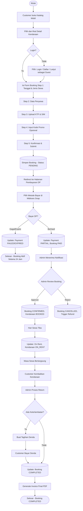
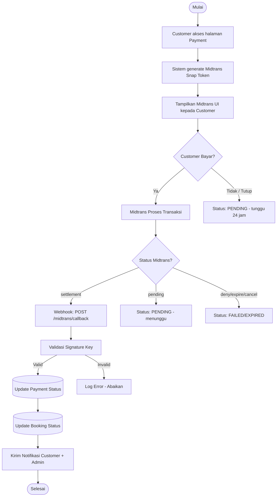
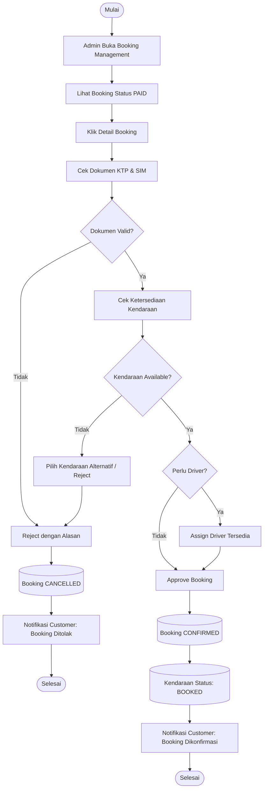

# Activity Diagram — Siliwangi Rental

**Nama File:** `activity-diagram.md`  
**Lokasi:** `documents/UML/`  
**Tujuan:** Dokumentasi activity diagram alur utama sistem Siliwangi Rental.

---

## 1. Activity Diagram — Booking Flow

---

## 2. Activity Diagram — Payment Flow

---

## 3. Activity Diagram — Admin Approval

---

Versi: 1.0.0 | Tanggal: 2026-05-14
