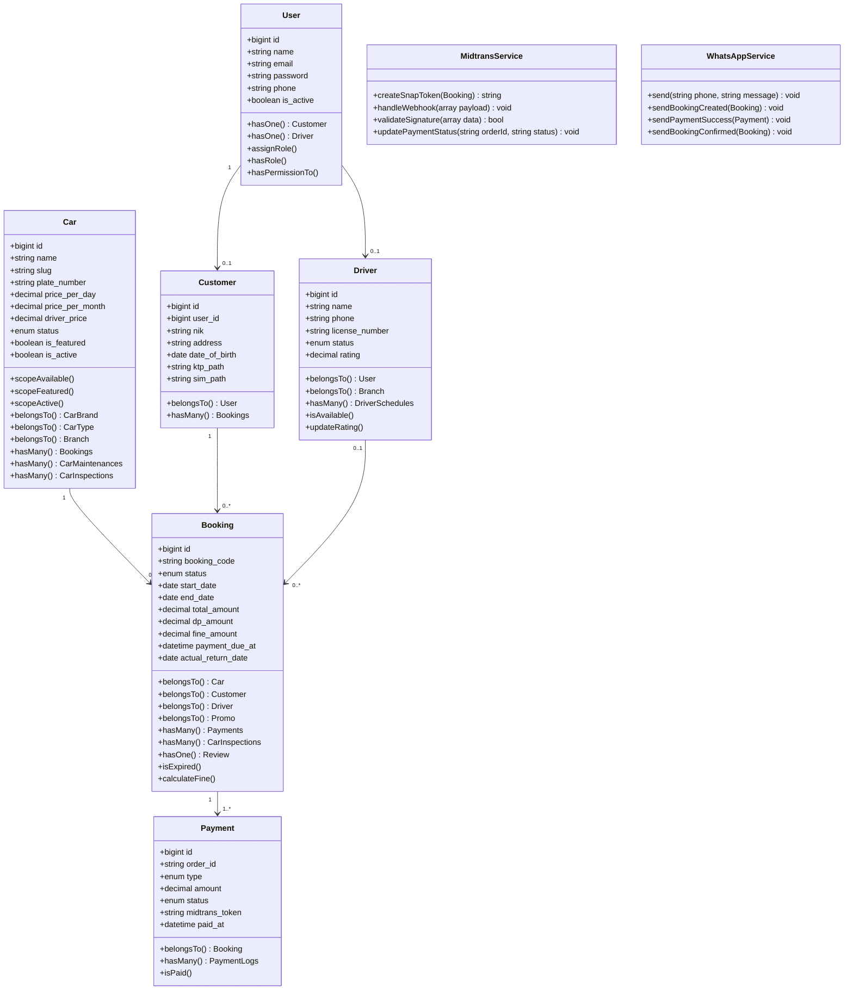

# Class Diagram — Siliwangi Rental

**Nama File:** `class-diagram.md`  
**Lokasi:** `documents/UML/`  
**Tujuan:** Dokumentasi class diagram Eloquent Models dan Service Layer sistem Siliwangi Rental.

---

## 1. Class Diagram — Core Models

---

## 2. Service Layer Classes

 | Kelas | File | Tanggung Jawab |
|---|---|---|
 | `MidtransService` | `app/Services/MidtransService.php` | Midtrans API integration, token, webhook |
 | `WhatsAppService` | `app/Services/WhatsAppService.php` | Kirim pesan WhatsApp via API |
 | `BookingService` | Belum ditentukan pada requirement | Logika booking, kalkulasi harga |
 | `ReportService` | Belum ditentukan pada requirement | Generate laporan, aggregate data |
 | `InvoiceService` | Belum ditentukan pada requirement | Generate PDF invoice |

---

Versi: 1.0.0 | Tanggal: 2026-05-14
