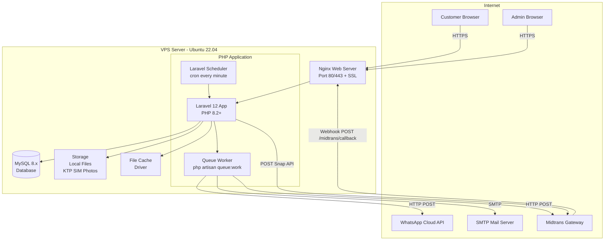

# Deployment Diagram — Siliwangi Rental

**Nama File:** `deployment-diagram.md`  
**Lokasi:** `documents/UML/`  
**Tujuan:** Dokumentasi deployment architecture sistem Siliwangi Rental.

---

## 1. Deployment Diagram



---

## 2. Deployment Components

 | Komponen | Teknologi | Keterangan |
|---|---|---|
 | Web Server | Nginx / Apache | Reverse proxy, SSL termination |
 | PHP Runtime | PHP 8.2 FPM | Proses Laravel app |
 | Database | MySQL 8.x | Data persistence |
 | File Storage | Local Storage | Upload KTP, SIM, foto kendaraan |
 | Queue | Database Driver | Async jobs: notifikasi, laporan |
 | Scheduler | Cron | Auto-expire booking, reminder |
 | Cache | File Driver | Data cache — car types, stats |
 | SSL | Let's Encrypt | HTTPS certificate gratis |

---

## 3. Environment

 | Environment | URL | Tujuan |
|---|---|---|
 | Local | `http://rental_project.test` | Development |
 | Staging | Belum ditentukan | Testing pra-production |
 | Production | Belum ditentukan | Live sistem |

---

## 4. Cron Setup

```bash
# /etc/crontab atau via crontab -e
* * * * * www-data php /path/to/artisan schedule:run >> /dev/null 2>&1
```

---

Versi: 1.0.0 | Tanggal: 2026-05-14
