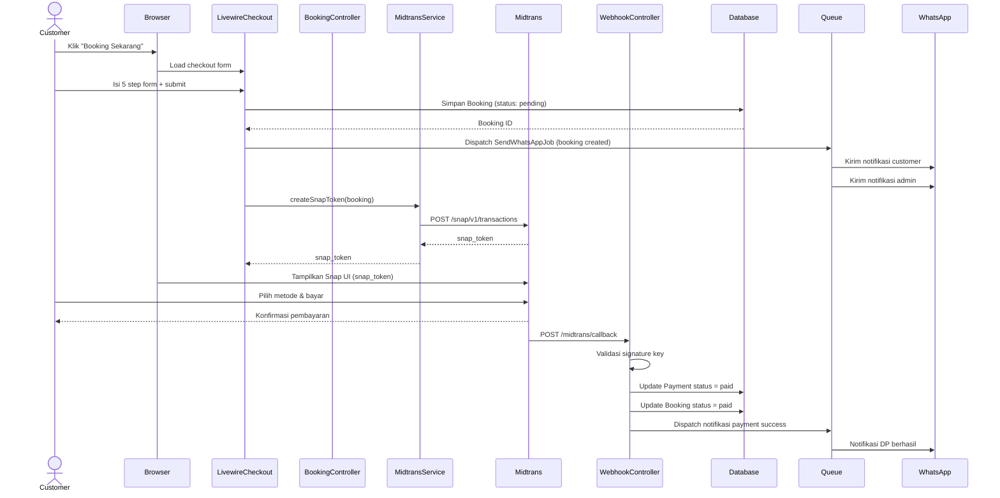
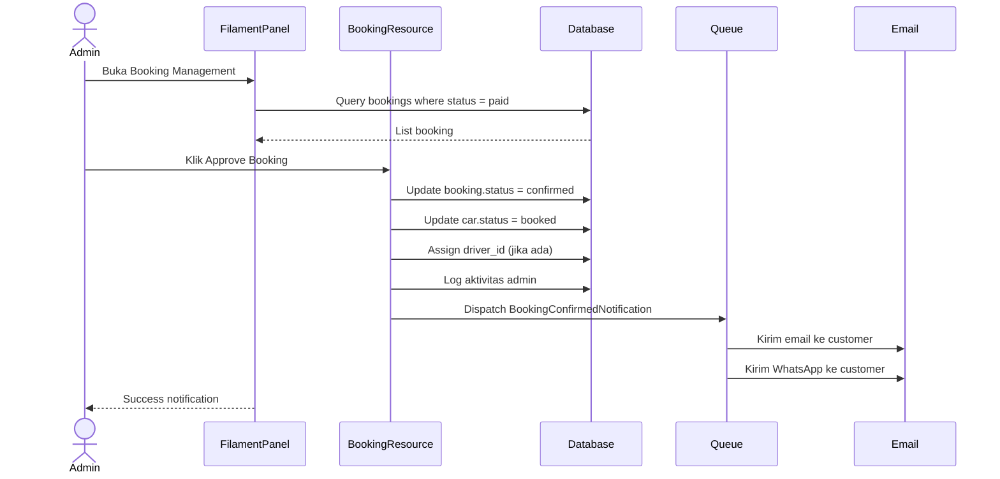
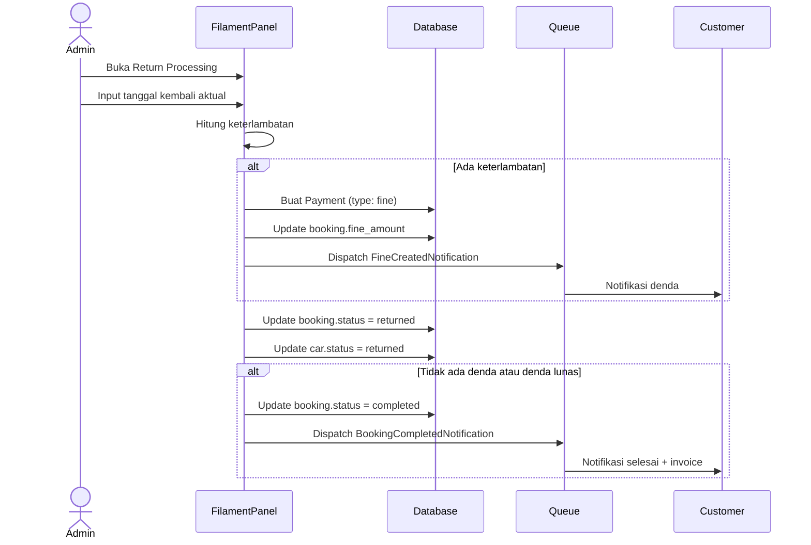

# Sequence Diagram — Siliwangi Rental

**Nama File:** `sequence-diagram.md`  
**Lokasi:** `documents/UML/`  
**Tujuan:** Dokumentasi sequence diagram interaksi antar komponen sistem.

---

## 1. Sequence Diagram — Booking + Payment

---

## 2. Sequence Diagram — Admin Approval

---

## 3. Sequence Diagram — Return Processing

---

Versi: 1.0.0 | Tanggal: 2026-05-14
