# Use Case Diagram — Siliwangi Rental

**Nama File:** `usecase-diagram.md`  
**Lokasi:** `documents/UML/`  
**Tujuan:** Dokumentasi use case diagram sistem Siliwangi Rental per aktor.

---

## Metadata Dokumen

 | Atribut | Detail |
|---|---|
 | Nama Project | Siliwangi Rental |
 | Versi | 1.0.0 |
 | Tanggal | 2026-05-14 |

---

## 1. Use Case Diagram (Mermaid)

```mermaid
graph LR
    subgraph Sistem Siliwangi Rental
        UC1[Registrasi Akun]
        UC2[Login]
        UC3[Lihat Katalog Mobil]
        UC4[Cari & Filter Kendaraan]
        UC5[Lihat Detail Kendaraan]
        UC6[Buat Booking]
        UC7[Guest Checkout]
        UC8[Upload KTP & SIM]
        UC9[Bayar DP via Midtrans]
        UC10[Lunasi Pembayaran]
        UC11[Bayar Denda]
        UC12[Download Invoice]
        UC13[Lihat Riwayat Booking]
        UC14[Batalkan Booking]
        UC15[Edit Profil]

        UC16[Approve/Reject Booking]
        UC17[Assign Driver]
        UC18[Kelola Kendaraan]
        UC19[Kelola Driver]
        UC20[Kelola Cabang]
        UC21[Kelola Promo]
        UC22[Return Processing]
        UC23[Buat Inspeksi]
        UC24[Kelola Maintenance]
        UC25[Lihat Dashboard Analytics]
        UC26[Generate Laporan]
        UC27[Export PDF/Excel]
        UC28[Kelola User & Role]

        UC29[Lihat Jadwal]
        UC30[Update Availability]

        UC31[Proses Refund]
        UC32[Konfirmasi Pembayaran]
    end

    Customer((Customer))
    Guest((Guest))
    Admin((Admin))
    Owner((Owner))
    Driver((Driver))
    Finance((Finance))

    Customer --> UC1
    Customer --> UC2
    Customer --> UC3
    Customer --> UC4
    Customer --> UC5
    Customer --> UC6
    Customer --> UC8
    Customer --> UC9
    Customer --> UC10
    Customer --> UC11
    Customer --> UC12
    Customer --> UC13
    Customer --> UC14
    Customer --> UC15

    Guest --> UC3
    Guest --> UC4
    Guest --> UC5
    Guest --> UC7
    Guest --> UC8
    Guest --> UC9

    Admin --> UC16
    Admin --> UC17
    Admin --> UC18
    Admin --> UC19
    Admin --> UC20
    Admin --> UC21
    Admin --> UC22
    Admin --> UC23
    Admin --> UC24
    Admin --> UC25
    Admin --> UC26
    Admin --> UC27
    Admin --> UC28

    Owner --> UC25
    Owner --> UC26
    Owner --> UC27
    Owner --> UC28

    Driver --> UC29
    Driver --> UC30
    Driver --> UC23

    Finance --> UC31
    Finance --> UC32
    Finance --> UC26
    Finance --> UC27
```

---

## 2. Use Case per Aktor

### Customer

 | Use Case | Deskripsi |
|---|---|
 | UC1 — Registrasi | Daftar akun dengan email dan password |
 | UC2 — Login | Masuk ke sistem |
 | UC3 — Lihat Katalog | Browse daftar kendaraan |
 | UC4 — Cari & Filter | Cari kendaraan berdasarkan kriteria |
 | UC5 — Detail Kendaraan | Lihat info lengkap kendaraan |
 | UC6 — Buat Booking | Proses pemesanan 5-step |
 | UC8 — Upload Dokumen | Upload KTP dan SIM |
 | UC9 — Bayar DP | Bayar uang muka via Midtrans |
 | UC10 — Lunasi | Bayar sisa pembayaran |
 | UC11 — Bayar Denda | Bayar denda keterlambatan |
 | UC12 — Invoice | Download invoice PDF |
 | UC13 — Riwayat | Lihat semua booking |
 | UC14 — Batalkan | Batalkan booking aktif |
 | UC15 — Edit Profil | Update data diri |

### Admin

 | Use Case | Deskripsi |
|---|---|
 | UC16 — Approve Booking | Terima atau tolak booking customer |
 | UC17 — Assign Driver | Tugaskan driver ke booking |
 | UC18 — Kelola Kendaraan | CRUD armada + update status |
 | UC19 — Kelola Driver | CRUD data driver |
 | UC20 — Kelola Cabang | CRUD cabang rental |
 | UC21 — Kelola Promo | CRUD promo diskon |
 | UC22 — Return Processing | Proses pengembalian kendaraan |
 | UC23 — Inspeksi | Input data inspeksi kendaraan |
 | UC24 — Maintenance | Jadwalkan dan track maintenance |
 | UC25 — Dashboard | Monitor KPI dan analytics |
 | UC26 — Laporan | Generate berbagai laporan |
 | UC27 — Export | Export laporan ke PDF/Excel |
 | UC28 — User & Role | Kelola akun pengguna dan role |

---

Versi: 1.0.0 | Tanggal: 2026-05-14
