# Use Case Diagram — Siliwangi Rental

**Nama File:** `usecase-diagram.md`  
**Lokasi:** `documents/UML/`  
**Tujuan:** Dokumentasi use case diagram sistem Siliwangi Rental per aktor.

---

## Metadata Dokumen

| Atribut | Detail |
|---|---|
| Nama Project | Siliwangi Rental |
| Versi | 1.0.1 |
| Tanggal | 2026-06-02 |

---

## 1. Use Case Diagram (Mermaid)

```mermaid
graph LR
    subgraph Sistem Siliwangi Rental
        UC1[Registrasi Akun]
        UC2[Login]
        UC3[Lihat Katalog Mobil]
        UC4[Cari & Filter Kendaraan]
        UC5[Lihat Detail Kendaraan]
        UC6[Buat Booking]
        UC7[Guest Checkout]
        UC8[Upload KTP & SIM]
        UC9[Bayar DP via Midtrans]
        UC10[Lunasi Pembayaran]
        UC11[Bayar Denda]
        UC12[Download Invoice]
        UC13[Lihat Riwayat Booking]
        UC14[Batalkan Booking]
        UC15[Edit Profil]

        UC16[Approve/Reject Booking]
        UC17[Assign Driver]
        UC18[Kelola Kendaraan]
        UC19[Kelola Driver]
        UC20[Kelola Cabang]
        UC21[Kelola Promo]
        UC22[Return Processing]
        UC23[Buat Log Pengecekan Operasional]
        UC24[Kelola Maintenance]
        UC25[Lihat Dashboard Analytics]
        UC26[Generate Laporan]
        UC27[Export PDF/Excel]
        UC28[Kelola User & Role]
        UC33[Input Hasil Survei Lokasi]

        UC29[Lihat Jadwal Driver]
        UC30[Update Availability Driver]

        UC31[Proses Refund]
        UC32[Konfirmasi Pembayaran]
    end

    Customer((Customer))
    Guest((Guest))
    Admin((Admin))
    Owner((Owner))
    Driver((Driver))
    Finance((Finance))
    Operasional((Petugas Operasional))

    Customer --> UC1
    Customer --> UC2
    Customer --> UC3
    Customer --> UC4
    Customer --> UC5
    Customer --> UC6
    Customer --> UC8
    Customer --> UC9
    Customer --> UC10
    Customer --> UC11
    Customer --> UC12
    Customer --> UC13
    Customer --> UC14
    Customer --> UC15

    Guest --> UC3
    Guest --> UC4
    Guest --> UC5
    Guest --> UC7
    Guest --> UC8
    Guest --> UC9

    Admin --> UC16
    Admin --> UC17
    Admin --> UC18
    Admin --> UC19
    Admin --> UC20
    Admin --> UC21
    Admin --> UC22
    Admin --> UC23
    Admin --> UC24
    Admin --> UC25
    Admin --> UC26
    Admin --> UC27
    Admin --> UC28
    Admin --> UC33

    Owner --> UC25
    Owner --> UC26
    Owner --> UC27
    Owner --> UC28

    Driver --> UC29
    Driver --> UC30
    Driver --> UC23

    Finance --> UC31
    Finance --> UC32
    Finance --> UC26
    Finance --> UC27

    Operasional --> UC22
    Operasional --> UC23
    Operasional --> UC24
    Operasional --> UC33
```

---

## 2. Deskripsi Use Case per Aktor

### Customer

| Use Case | Deskripsi |
|---|---|
| UC1 — Registrasi | Daftar akun dengan email, password, dan nomor telepon |
| UC2 — Login | Masuk ke panel/sistem Siliwangi Rental |
| UC3 — Lihat Katalog | Browse daftar mobil yang siap disewa |
| UC4 — Cari & Filter | Memfilter mobil berdasarkan tipe, transmisi, harga, dan cabang |
| UC5 — Detail Kendaraan | Melihat spesifikasi lengkap, harga harian, dan ketersediaan unit |
| UC6 — Buat Booking | Memesan mobil melalui wizard checkout 5 langkah |
| UC8 — Upload Dokumen | Mengunggah foto KTP, SIM A, dan KK untuk verifikasi |
| UC9 — Bayar DP | Pembayaran uang muka secara online menggunakan Midtrans gateway |
| UC10 — Lunasi | Menyelesaikan pelunasan sisa pembayaran sewa |
| UC11 — Bayar Denda | Membayar denda keterlambatan atau denda operasional jika ada |
| UC12 — Invoice | Mengunduh lembar bukti pemesanan formal (invoice PDF) |
| UC13 — Riwayat | Memantau daftar riwayat transaksi booking sebelumnya |
| UC14 — Batalkan | Mengajukan pembatalan pemesanan sewa aktif |
| UC15 — Edit Profil | Mengubah informasi profil kustomer dan data kontak |

### Guest (Penyewa Tanpa Akun)

| Use Case | Deskripsi |
|---|---|
| UC3 — Lihat Katalog | Browse daftar kendaraan tanpa harus masuk sistem |
| UC4 — Cari & Filter | Menyaring tipe armada di halaman katalog umum |
| UC5 — Detail Kendaraan | Membaca detail informasi spesifikasi dan kelayakan armada |
| UC7 — Guest Checkout | Memesan kendaraan langsung menggunakan token identitas sementara |
| UC8 — Upload Dokumen | Mengunggah file identitas KTP/SIM saat proses checkout guest |
| UC9 — Bayar DP | Melakukan transaksi uang muka lewat payment gateway |

### Petugas Operasional

| Use Case | Deskripsi |
|---|---|
| UC22 — Return Processing | Memproses pengembalian kendaraan yang selesai disewa |
| UC23 — Log Operasional | Membuat rekaman checklist inspeksi fisik keluar/masuk mobil |
| UC24 — Kelola Maintenance | Menginput log perbaikan, perawatan berkala, dan status bengkel mobil |
| UC33 — Input Hasil Survei | Mengunggah hasil verifikasi tempat tinggal kustomer baru lapangan |

### Driver (Sopir Mitra)

| Use Case | Deskripsi |
|---|---|
| UC23 — Log Operasional | Membantu pengecekan kondisi kelayakan armada saat hendak berangkat |
| UC29 — Lihat Jadwal | Memantau agenda penugasan sopir untuk melayani penyewa |
| UC30 — Update Availability | Mengubah status kesediaan kerja sopir (aktif/tidak aktif) |

### Finance (Staf Keuangan)

| Use Case | Deskripsi |
|---|---|
| UC26 — Generate Laporan | Menyusun laporan keuangan mingguan/bulanan cabang |
| UC27 — Export PDF/Excel | Mengunduh data audit keuangan untuk diarsipkan |
| UC31 — Proses Refund | Melakukan transfer dana pembatalan sewa yang valid |
| UC32 — Konfirmasi Pembayaran | Mengubah status pembayaran manual atau memverifikasi log Midtrans |

### Admin (Staf Administrasi Cabang)

| Use Case | Deskripsi |
|---|---|
| UC16 — Approve Booking | Memvalidasi kelayakan berkas kustomer untuk lanjut/tolak sewa |
| UC17 — Assign Driver | Menunjuk sopir mitra yang cocok dengan jadwal sewa |
| UC18 — Kelola Kendaraan | Melakukan CRUD data spesifikasi, harga sewa, dan status armada |
| UC19 — Kelola Driver | Melakukan CRUD data akun dan status keaktifan sopir |
| UC20 — Kelola Cabang | Melakukan CRUD data logistik, telepon, dan alamat gerai cabang |
| UC21 — Kelola Promo | Membuat kode kupon potongan harga sewa baru |
| UC22 — Return Processing | Membantu validasi pengembalian kunci dan armada dari kustomer |
| UC23 — Log Operasional | Mengawasi kelayakan pengisian log operasional keluar/masuk |
| UC24 — Kelola Maintenance | Mengawasi penginputan jadwal servis mesin armada |
| UC25 — Dashboard | Memantau aktivitas transaksi dan ketersediaan armada |
| UC26 — Laporan | Membuat laporan ringkas tingkat pemesanan armada |
| UC27 — Export PDF/Excel | Mengunduh laporan performa operasional |
| UC28 — User & Role | Mengelola hak akses admin, operator, finance, dan sopir |
| UC33 — Input Hasil Survei | Mengawasi laporan survei lokasi kustomer |

### Owner (Pemilik Siliwangi Rental)

| Use Case | Deskripsi |
|---|---|
| UC25 — Dashboard | Memantau omzet, statistik mobil terlaris, dan kinerja cabang |
| UC26 — Laporan | Meninjau laporan konsolidasian seluruh cabang |
| UC27 — Export PDF/Excel | Mengunduh laporan kinerja tahunan/bulanan untuk Rapat Direksi |
| UC28 — User & Role | Mengawasi akun pengguna yang dapat masuk ke panel manajemen |

---

Versi: 1.0.1 | Tanggal: 2026-06-02
