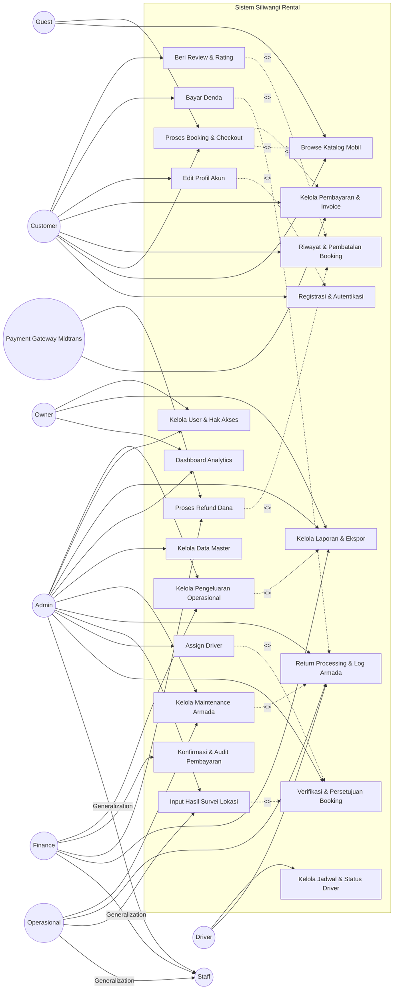

# Use Case Diagram — Siliwangi Rental

**Nama File:** `usecase-diagram.md`
**Lokasi:** `documents/UML/`
**Tujuan:** Dokumentasi Use Case Diagram Sistem Siliwangi Rental berdasarkan aktor dan proses bisnis utama yang terintegrasi dengan ERD sistem.

---

## Metadata Dokumen

| Atribut      | Detail                                |
| ------------ | ------------------------------------- |
| Nama Project | Website Rental Mobil Siliwangi Rental |
| Versi        | 3.0.0                                 |
| Tanggal      | 2026-06-02                            |

---

## 1. Use Case Diagram (Mermaid)

---

## 2. Daftar Use Case

| Kode | Nama Use Case                    |
| ---- | -------------------------------- |
| UC1  | Registrasi & Autentikasi         |
| UC2  | Browse Katalog Mobil             |
| UC3  | Proses Booking & Checkout        |
| UC4  | Riwayat & Pembatalan Booking     |
| UC5  | Kelola Pembayaran & Invoice      |
| UC6  | Edit Profil Akun                 |
| UC7  | Verifikasi & Persetujuan Booking |
| UC8  | Assign Driver                    |
| UC9  | Input Hasil Survei Lokasi        |
| UC10 | Return Processing & Log Armada   |
| UC11 | Bayar Denda                      |
| UC12 | Kelola Maintenance Armada        |
| UC13 | Kelola Jadwal & Status Driver    |
| UC14 | Kelola Data Master               |
| UC15 | Dashboard Analytics              |
| UC16 | Kelola Laporan & Ekspor          |
| UC17 | Kelola User & Hak Akses          |
| UC18 | Proses Refund Dana               |
| UC19 | Konfirmasi & Audit Pembayaran    |
| UC20 | Beri Review & Rating             |
| UC21 | Kelola Pengeluaran Operasional   |

---

## 3. Relasi Include

| Base Use Case | Include Use Case | Keterangan                                      |
| ------------- | ---------------- | ----------------------------------------------- |
| UC3           | UC2              | Booking memerlukan pemilihan mobil dari katalog |
| UC3           | UC5              | Checkout selalu menghasilkan proses pembayaran  |
| UC6           | UC1              | Edit profil memerlukan autentikasi pengguna     |
| UC21          | UC16             | Data pengeluaran digunakan dalam laporan        |

---

## 4. Relasi Extend

| Base Use Case | Extend Use Case | Kondisi                                                           |
| ------------- | --------------- | ----------------------------------------------------------------- |
| UC7           | UC8             | Jika pelanggan memilih layanan sopir                              |
| UC7           | UC9             | Jika diperlukan survei lokasi pelanggan                           |
| UC10          | UC11            | Jika terjadi denda keterlambatan atau kerusakan                   |
| UC10          | UC12            | Jika kendaraan membutuhkan servis/perbaikan                       |
| UC4           | UC18            | Jika booking dibatalkan dan terdapat dana yang harus dikembalikan |
| UC4           | UC20            | Jika transaksi telah selesai dan pelanggan memberikan ulasan      |

---

## 5. Keterkaitan dengan ERD

| Tabel            | Use Case Terkait      |
| ---------------- | --------------------- |
| users            | UC1, UC6, UC17        |
| stores           | UC14                  |
| cars             | UC2, UC14             |
| drivers          | UC8, UC13, UC14       |
| driver_schedules | UC8, UC13             |
| bookings         | UC3, UC4, UC7, UC10   |
| payments         | UC5, UC11, UC18, UC19 |
| promos           | UC3, UC14             |
| reviews          | UC20                  |
| expenses         | UC21                  |
| maintenance      | UC12                  |

---

**Versi:** 3.0.0
**Tanggal:** 2026-06-02
