# 3.4.2 Hasil Implementasi Sistem

Berdasarkan use case diagram Sistem Booking Rental Mobil Siliwangi Rental, berikut adalah hasil implementasi antarmuka (_user interface_) dari seluruh fitur yang terdapat pada sistem.

## a. Tampilan Customer

### 1. Implementasi Website Halaman Beranda (Home)

Menampilkan informasi utama perusahaan, kendaraan unggulan, promo, serta tombol pemesanan.

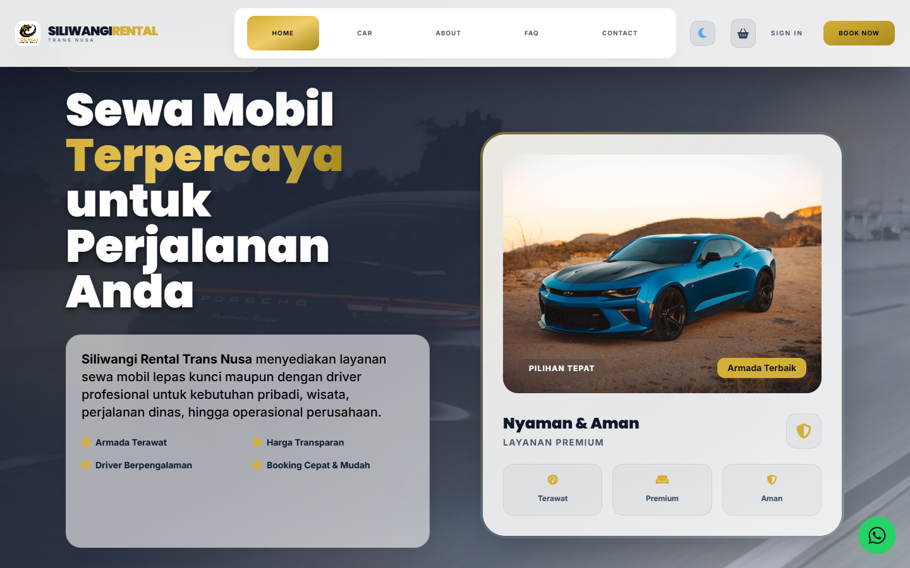

### 2. Implementasi Website Halaman Daftar Kendaraan (Car)

Menampilkan daftar kendaraan yang tersedia lengkap dengan spesifikasi, harga sewa, dan status ketersediaan.

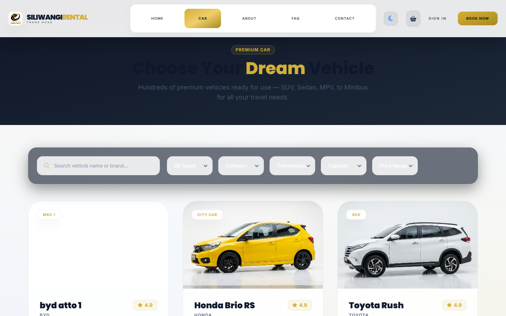

### 3. Implementasi Website Halaman FAQ

Menampilkan daftar pertanyaan dan jawaban yang sering diajukan oleh pelanggan.

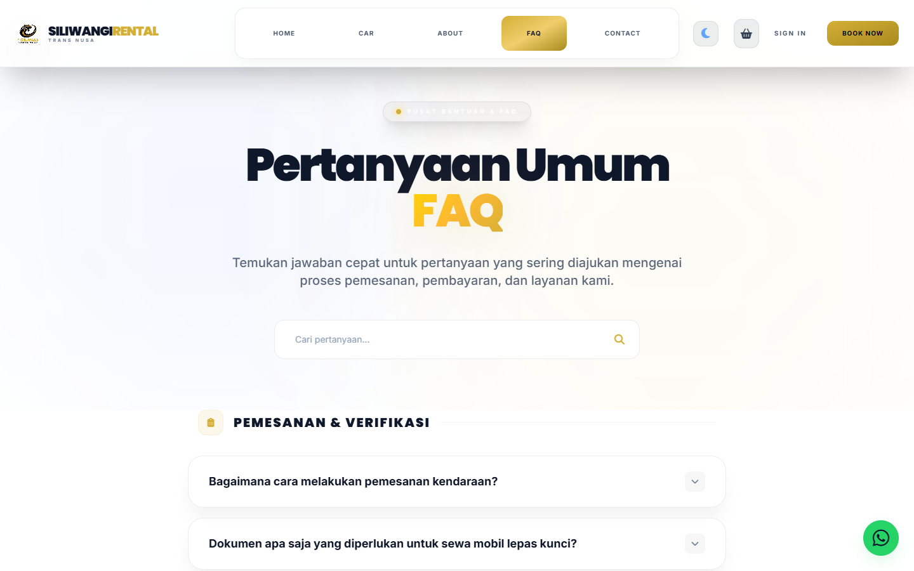

### 4. Implementasi Website Halaman Kontak (Contact)

Menampilkan informasi kontak perusahaan, alamat, email, nomor telepon, dan formulir kontak.

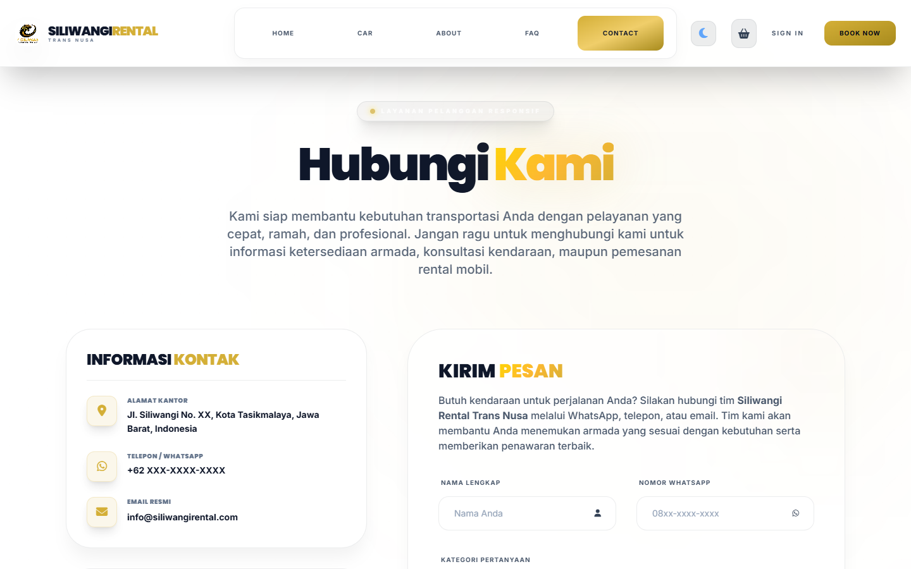

### 5. Implementasi Website Halaman Tentang Kami (About Us)

Menampilkan profil perusahaan, visi misi, serta informasi layanan rental mobil.

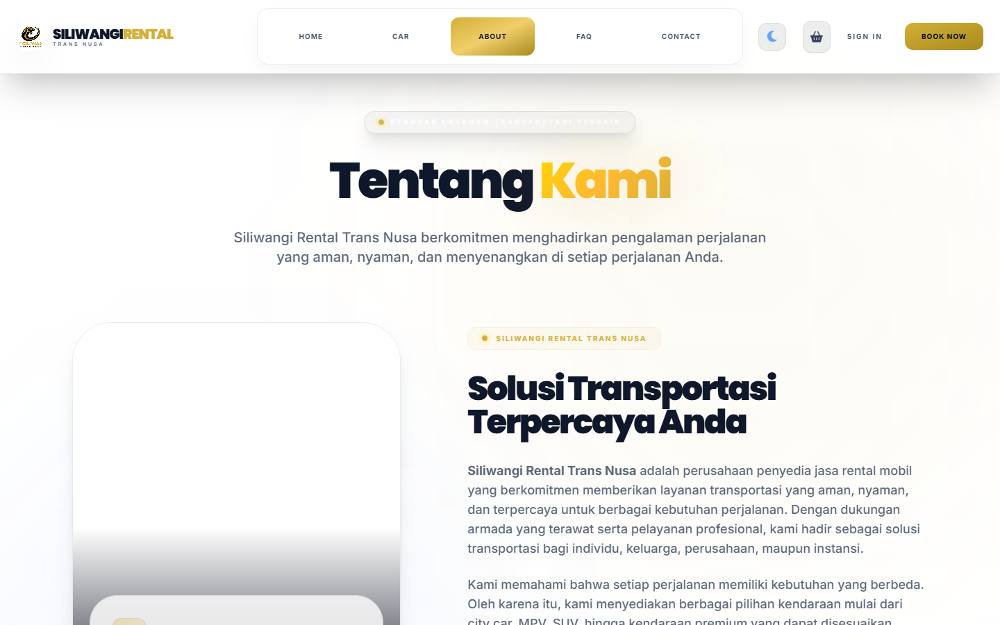

### 6. Implementasi Registrasi Customer

Fitur pendaftaran akun pelanggan baru dengan validasi data pengguna.

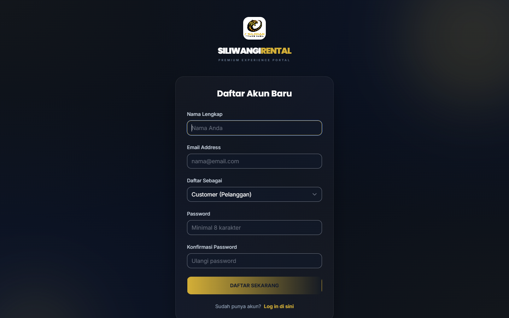

### 7. Implementasi Login Customer

Fitur autentikasi pengguna untuk mengakses layanan booking dan pengelolaan akun.

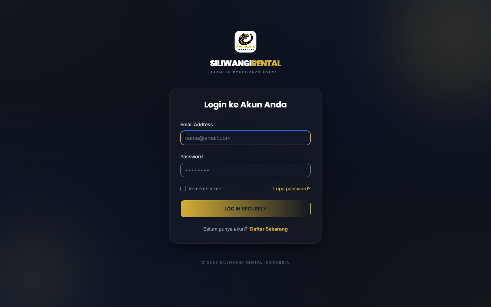

### 8. Implementasi Kelola Profil Customer

Fitur untuk mengubah data profil pelanggan seperti nama, nomor telepon, alamat, dan kata sandi.

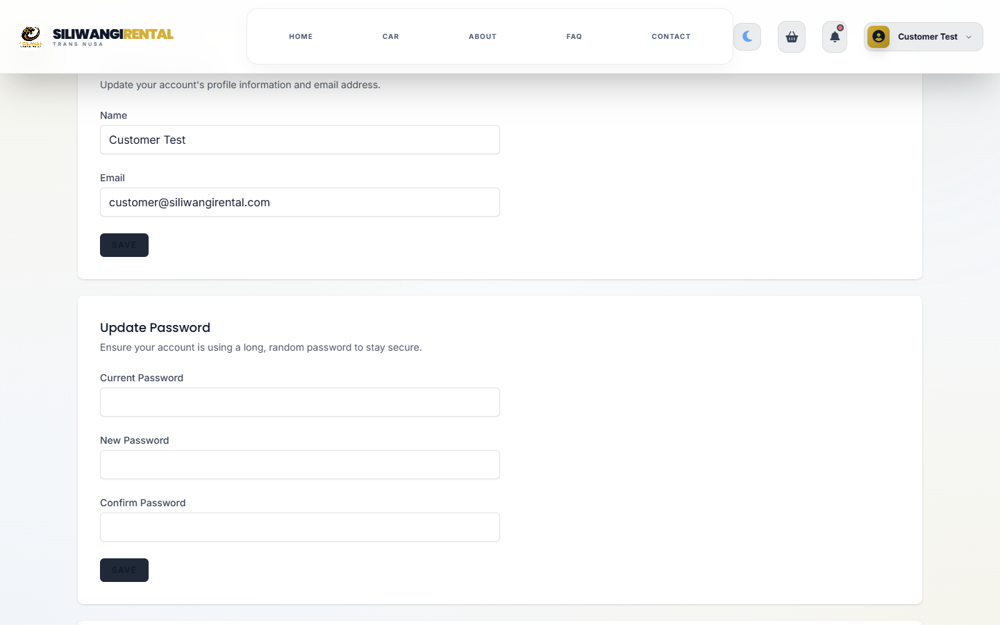

### 9. Implementasi Booking Kendaraan

Fitur pemesanan kendaraan dengan memilih kendaraan, tanggal sewa, lokasi penjemputan, dan durasi rental.

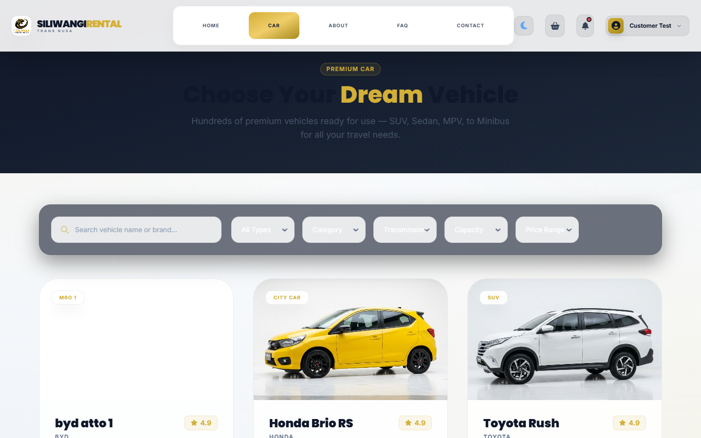

### 10. Implementasi Checkout Booking

Fitur konfirmasi data pemesanan sebelum melakukan pembayaran.

### 11. Implementasi Pembayaran Booking

Fitur pembayaran transaksi rental melalui payment gateway.

### 12. Implementasi Invoice Pembayaran

Menampilkan detail tagihan dan bukti pembayaran pelanggan.

### 13. Implementasi Riwayat Booking Customer

Menampilkan daftar transaksi pemesanan yang pernah dilakukan pelanggan.

### 14. Implementasi Detail Booking Customer

Menampilkan informasi detail pemesanan termasuk status booking dan pembayaran.

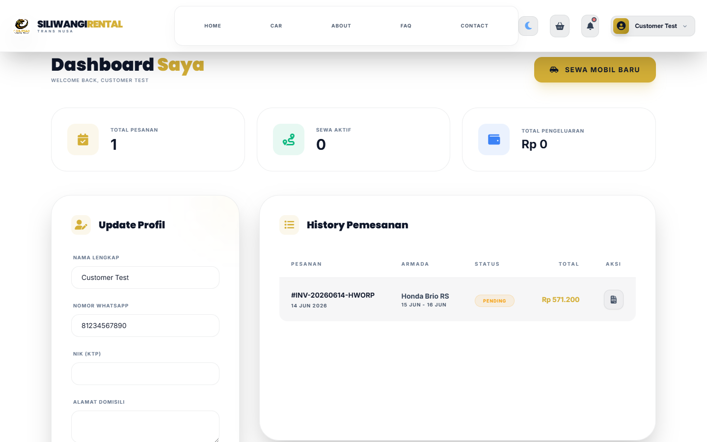

### 15. Implementasi Pembatalan Booking

Fitur untuk membatalkan pesanan sesuai ketentuan yang berlaku.

### 16. Implementasi Pengajuan Refund Dana

Fitur pengajuan pengembalian dana apabila terjadi pembatalan transaksi.

### 17. Implementasi Pembayaran Denda

Fitur pembayaran denda keterlambatan atau pelanggaran selama masa sewa.

### 18. Implementasi Review dan Rating

Fitur pemberian ulasan dan penilaian terhadap layanan rental yang telah digunakan.

---

## b. Tampilan Admin

### 1. Implementasi Dashboard Admin

Menampilkan ringkasan data booking, kendaraan, pembayaran, dan statistik penyewaan.

### 2. Implementasi Kelola Data Kendaraan

Fitur pengelolaan data kendaraan yang tersedia pada sistem.

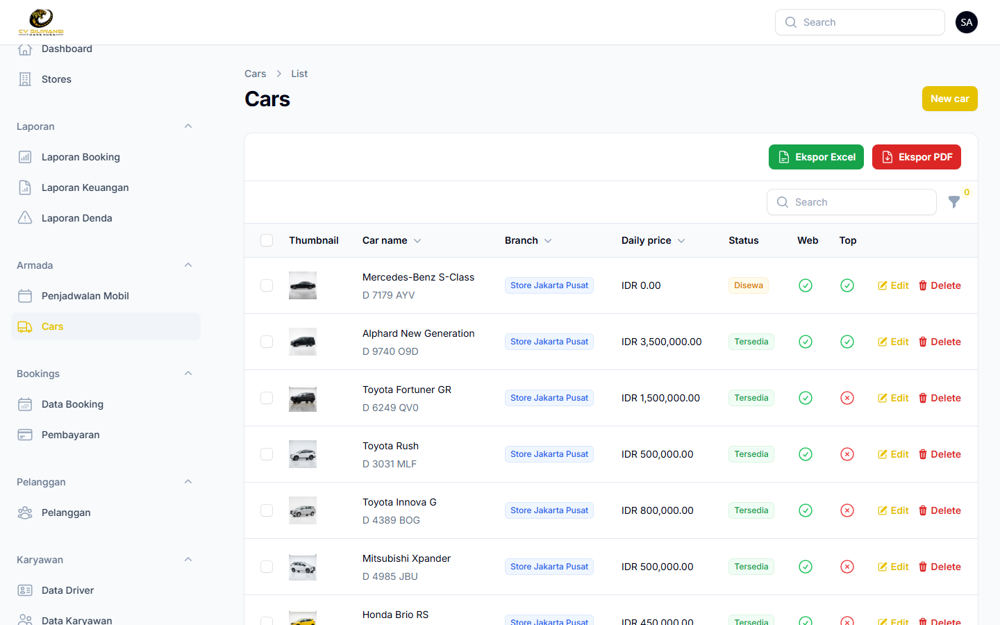

### 3. Implementasi Tambah Kendaraan

Fitur menambahkan data kendaraan baru.

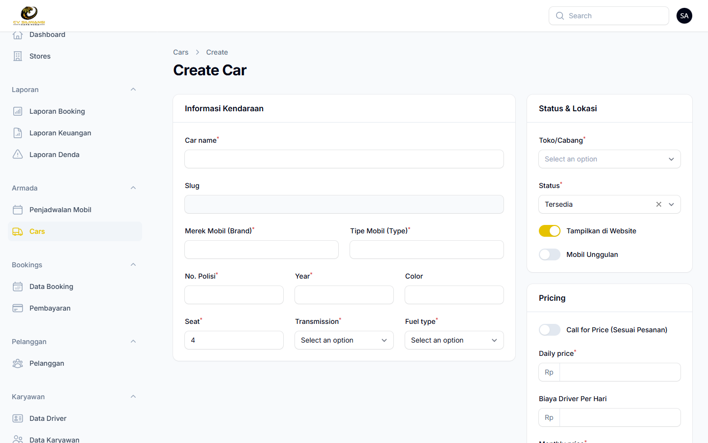

### 4. Implementasi Edit dan Hapus Kendaraan

Fitur memperbarui dan menghapus data kendaraan.

### 5. Implementasi Kelola Data Customer

Fitur pengelolaan data pelanggan yang terdaftar pada sistem.

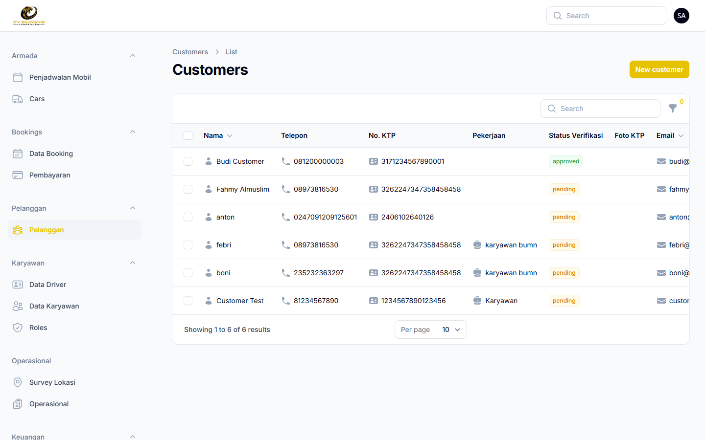

### 6. Implementasi Kelola Booking

Fitur verifikasi, persetujuan, dan pengelolaan data booking pelanggan.

### 7. Implementasi Booking Manual Customer

Fitur pencatatan booking yang dilakukan melalui WhatsApp atau datang langsung ke lokasi.

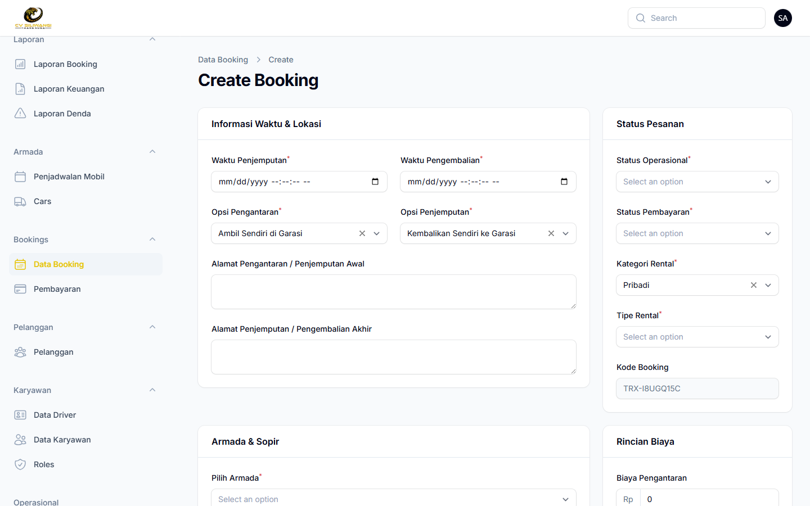

### 8. Implementasi Kelola Pembayaran

Fitur monitoring dan pengelolaan seluruh transaksi pembayaran.

### 9. Implementasi Konfirmasi Pembayaran

Fitur verifikasi status pembayaran dari pelanggan.

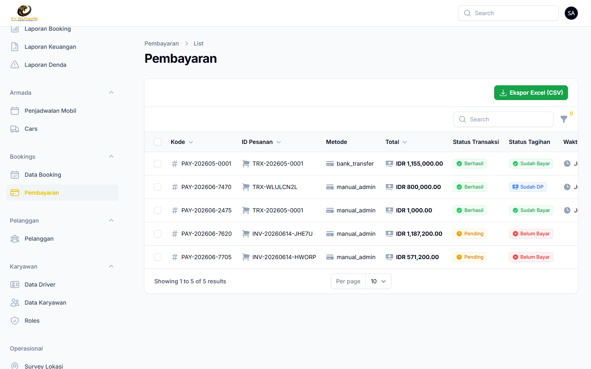

### 10. Implementasi Kelola Promo

Fitur pengelolaan kode promo dan diskon penyewaan.

### 11. Implementasi Kelola Driver

Fitur pengelolaan data driver serta penugasan driver kepada pelanggan.

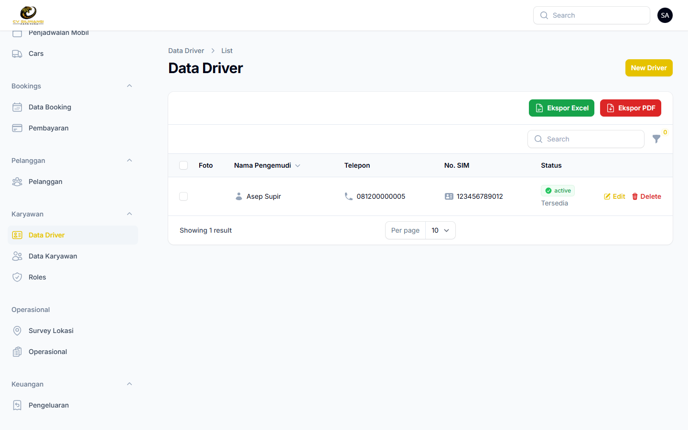

### 12. Implementasi Kelola Jadwal Driver

Fitur pengaturan jadwal dan status ketersediaan driver.

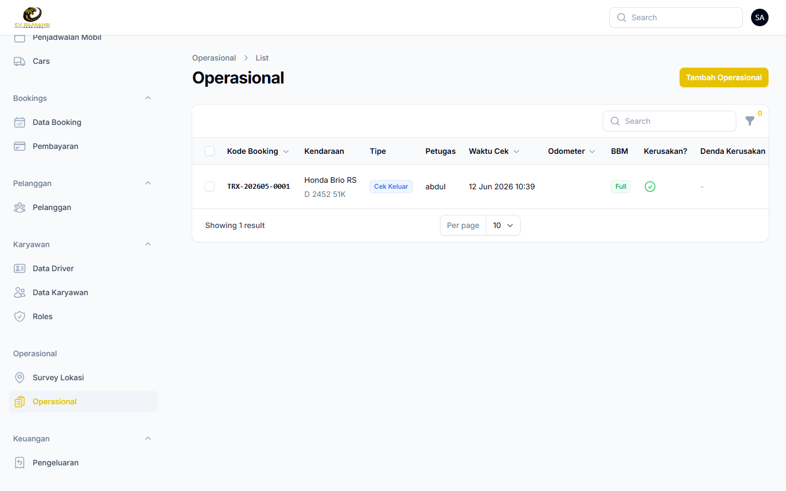

### 13. Implementasi Kelola Cabang/Toko

Fitur pengelolaan data cabang atau lokasi operasional perusahaan.

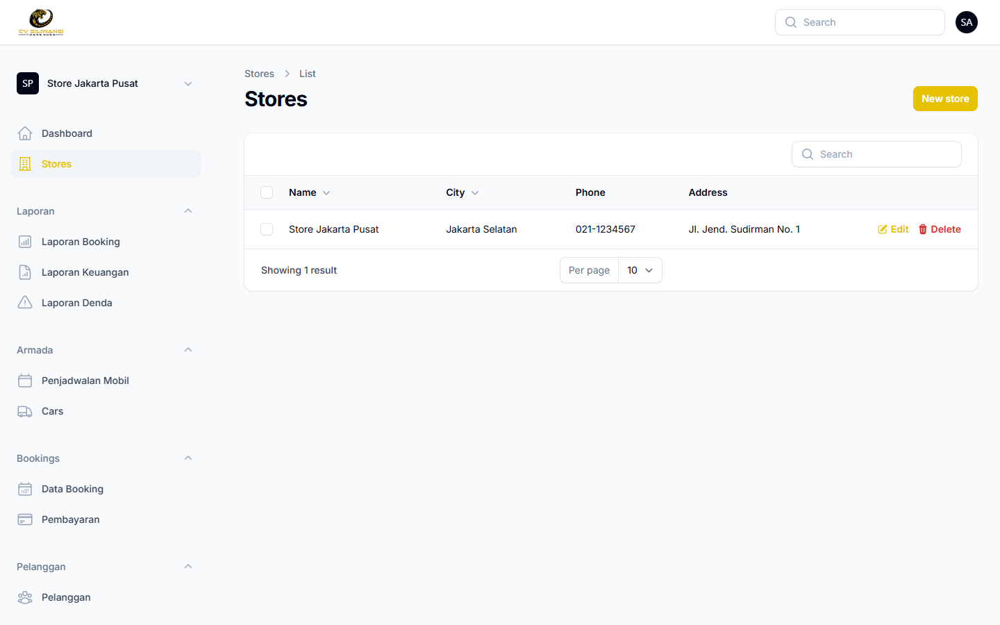

### 14. Implementasi Kelola User dan Hak Akses

Fitur pengaturan akun pengguna sistem beserta level aksesnya.

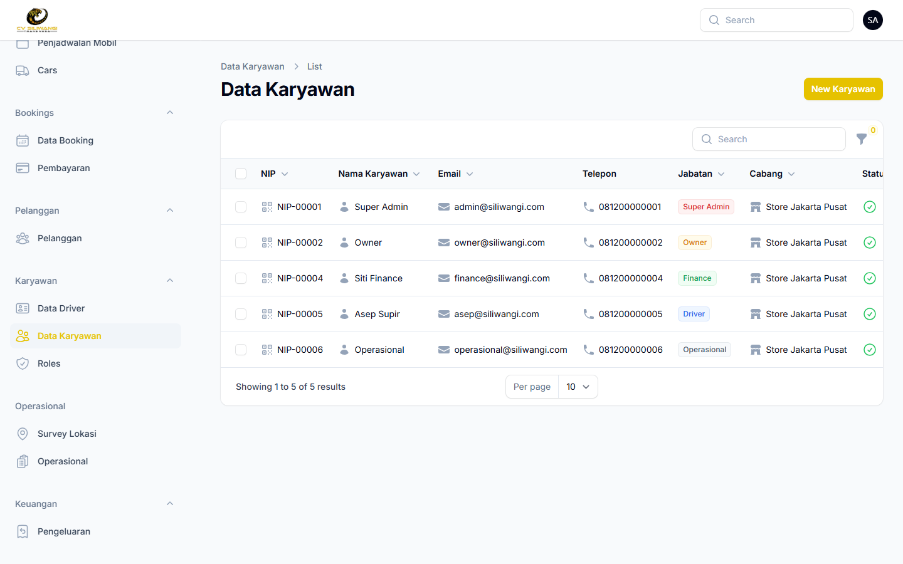

### 15. Implementasi Input Hasil Survei Lokasi

Fitur pencatatan hasil survei lokasi pelanggan sebelum proses penyewaan.

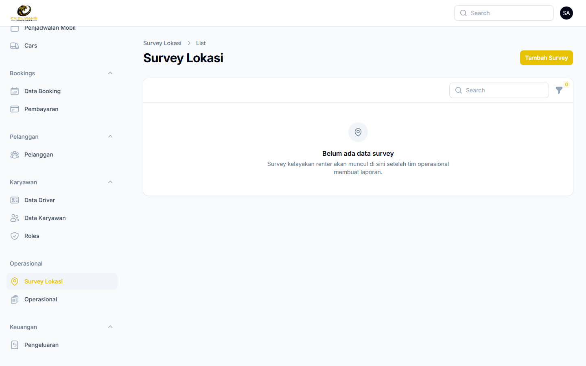

### 16. Implementasi Return Processing Kendaraan

Fitur pencatatan pengembalian kendaraan dan pemeriksaan kondisi kendaraan.

### 17. Implementasi Kelola Maintenance Kendaraan

Fitur pengelolaan jadwal servis dan perawatan armada.

### 18. Implementasi Kelola Refund Dana

Fitur persetujuan dan proses pengembalian dana kepada pelanggan.

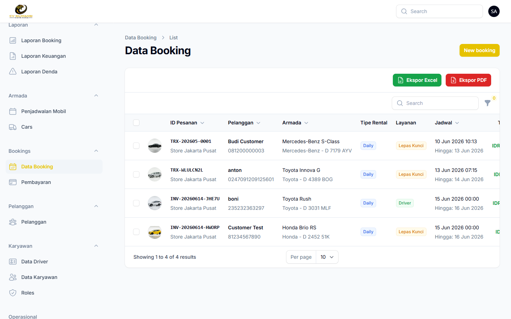

### 19. Implementasi Kelola Pengeluaran Operasional

Fitur pencatatan biaya operasional perusahaan.

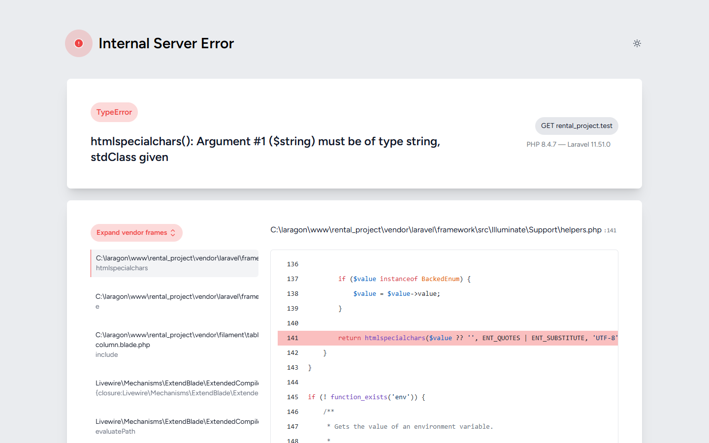

### 20. Implementasi Dashboard Analytics

Fitur visualisasi statistik transaksi, pendapatan, dan penggunaan armada.

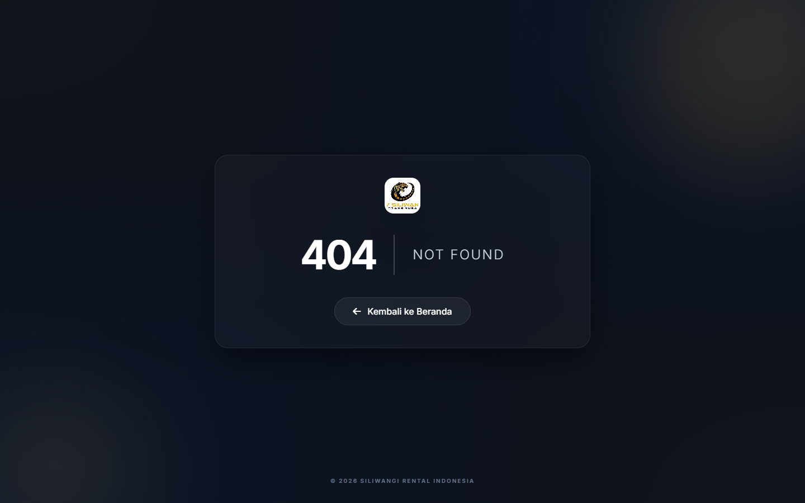

### 21. Implementasi Laporan Penyewaan

Menampilkan laporan data penyewaan kendaraan berdasarkan periode tertentu.

### 22. Implementasi Laporan Pembayaran

Menampilkan laporan transaksi pembayaran pelanggan.

### 23. Implementasi Laporan Kendaraan

Menampilkan laporan penggunaan dan ketersediaan armada.

### 24. Implementasi Ekspor Laporan

Fitur ekspor laporan ke format PDF atau Excel.

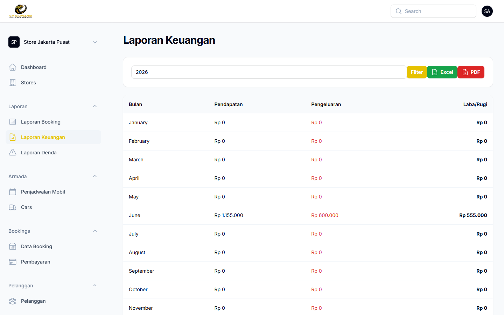

---

## c. Tampilan Driver

### 1. Implementasi Login Driver

Fitur autentikasi akun driver.

### 2. Implementasi Kelola Jadwal Driver

Menampilkan jadwal tugas dan status ketersediaan driver.

### 3. Implementasi Detail Penugasan Driver

Menampilkan informasi pelanggan, kendaraan, dan jadwal perjalanan.

### 4. Implementasi Input Status Perjalanan

Fitur pembaruan status perjalanan selama proses rental berlangsung.

### 5. Implementasi Konfirmasi Penyelesaian Tugas

Fitur konfirmasi bahwa tugas pengantaran atau penjemputan telah selesai dilakukan.

