# 3.4.2 Rancangan Sistem

Berdasarkan use case diagram Sistem Booking Rental Mobil Siliwangi Rental, berikut adalah hasil rancangan antarmuka (_user interface design/wireframe_) dari seluruh fitur yang terdapat pada sistem.

## a. Tampilan Customer

### 1. Rancangan Website Halaman Beranda (Home)

Menampilkan informasi utama perusahaan, kendaraan unggulan, promo, serta tombol pemesanan.

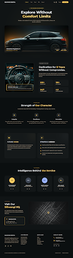

### 2. Rancangan Website Halaman Daftar Kendaraan (Car)

Menampilkan daftar kendaraan yang tersedia lengkap dengan spesifikasi, harga sewa, dan status ketersediaan.

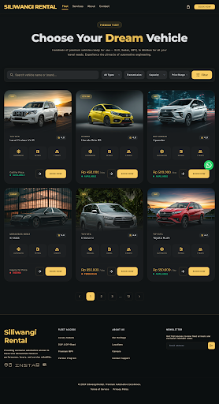

### 3. Rancangan Website Halaman FAQ

Menampilkan daftar pertanyaan dan jawaban yang sering diajukan oleh pelanggan.

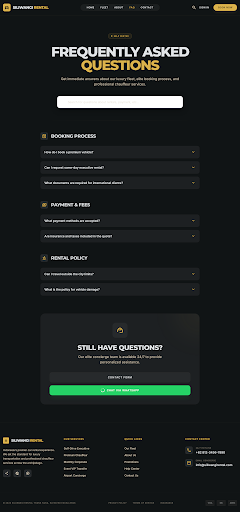

### 4. Rancangan Website Halaman Kontak (Contact)

Menampilkan informasi kontak perusahaan, alamat, email, nomor telepon, dan formulir kontak.

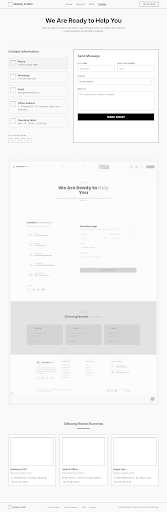

### 5. Rancangan Website Halaman Tentang Kami (About Us)

Belum ditentukan pada requirement.

### 6. Rancangan Registrasi Customer

Fitur pendaftaran akun pelanggan baru dengan validasi data pengguna.

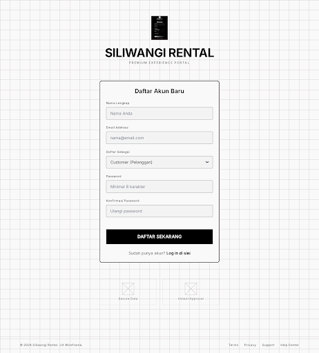

### 7. Rancangan Login Customer

Fitur autentikasi pengguna untuk mengakses layanan booking dan pengelolaan akun.

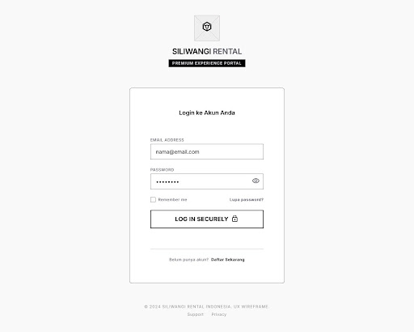

### 8. Rancangan Kelola Profil Customer

Belum ditentukan pada requirement.

### 9. Rancangan Booking Kendaraan

Fitur pemesanan kendaraan dengan memilih kendaraan, tanggal sewa, lokasi penjemputan, dan durasi rental.

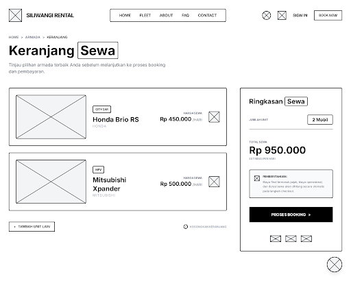

### 10. Rancangan Checkout Booking

Fitur konfirmasi data pemesanan sebelum melakukan pembayaran.

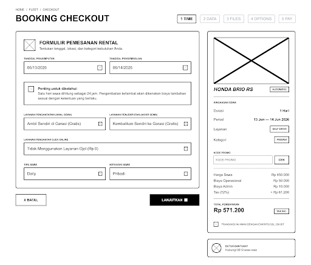

### 11. Rancangan Pembayaran Booking

Fitur pembayaran transaksi rental melalui payment gateway.

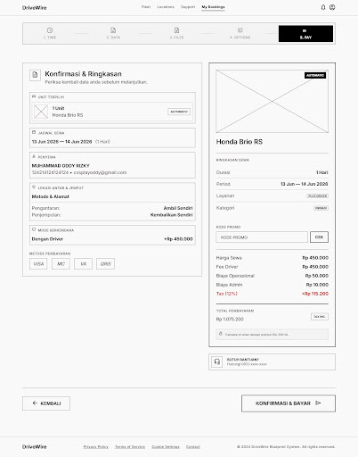

### 12. Rancangan Invoice Pembayaran

Menampilkan detail tagihan dan bukti pembayaran pelanggan.

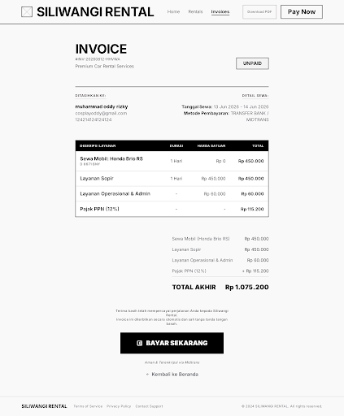

### 13. Rancangan Riwayat Booking Customer

Belum ditentukan pada requirement.

### 14. Rancangan Detail Booking Customer

Menampilkan informasi detail pemesanan termasuk status booking dan pembayaran.

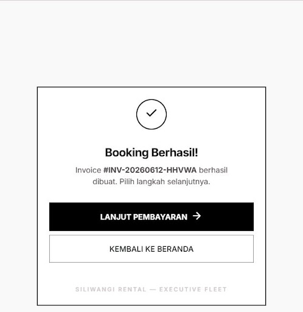

### 15. Rancangan Pembatalan Booking

Belum ditentukan pada requirement.

### 16. Rancangan Pengajuan Refund Dana

Belum ditentukan pada requirement.

### 17. Rancangan Pembayaran Denda

Belum ditentukan pada requirement.

### 18. Rancangan Review dan Rating

Belum ditentukan pada requirement.

---

## b. Tampilan Admin

### 1. Rancangan Dashboard Admin

Menampilkan ringkasan data booking, kendaraan, pembayaran, dan statistik penyewaan.

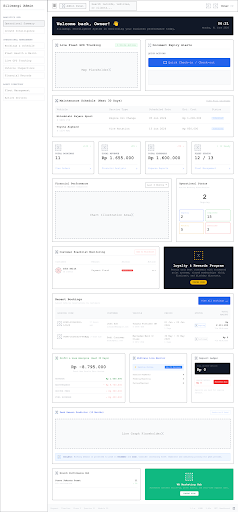

### 2. Rancangan Kelola Data Kendaraan

Fitur pengelolaan data kendaraan yang tersedia pada sistem.

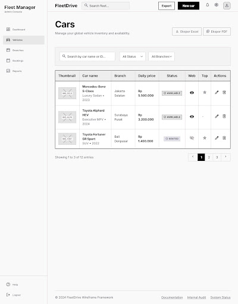

### 3. Rancangan Tambah Kendaraan

Fitur menambahkan data kendaraan baru.

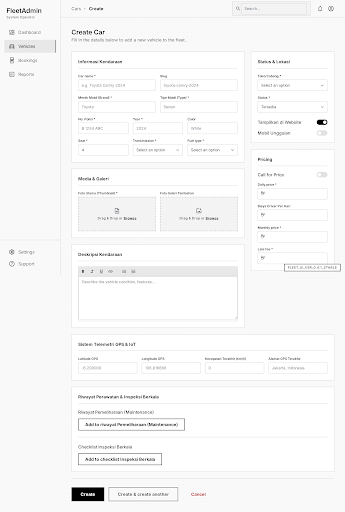

### 4. Rancangan Edit dan Hapus Kendaraan

Belum ditentukan pada requirement.

### 5. Rancangan Kelola Data Customer

Belum ditentukan pada requirement.

### 6. Rancangan Kelola Booking

Fitur verifikasi, persetujuan, dan pengelolaan data booking pelanggan.

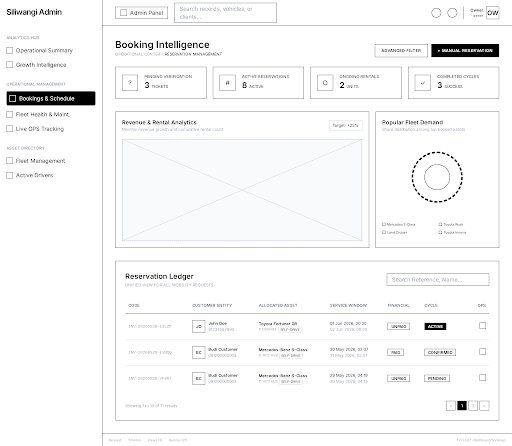

### 7. Rancangan Booking Manual Customer

Belum ditentukan pada requirement.

### 8. Rancangan Kelola Pembayaran

Belum ditentukan pada requirement.

### 9. Rancangan Konfirmasi Pembayaran

Belum ditentukan pada requirement.

### 10. Rancangan Kelola Promo

Belum ditentukan pada requirement.

### 11. Rancangan Kelola Driver

Belum ditentukan pada requirement.

### 12. Rancangan Kelola Jadwal Driver

Belum ditentukan pada requirement.

### 13. Rancangan Kelola Cabang/Toko

Belum ditentukan pada requirement.

### 14. Rancangan Kelola User dan Hak Akses

Belum ditentukan pada requirement.

### 15. Rancangan Input Hasil Survei Lokasi

Belum ditentukan pada requirement.

### 16. Rancangan Return Processing Kendaraan

Belum ditentukan pada requirement.

### 17. Rancangan Kelola Maintenance Kendaraan

Belum ditentukan pada requirement.

### 18. Rancangan Kelola Refund Dana

Belum ditentukan pada requirement.

### 19. Rancangan Kelola Pengeluaran Operasional

Fitur pencatatan biaya operasional perusahaan.

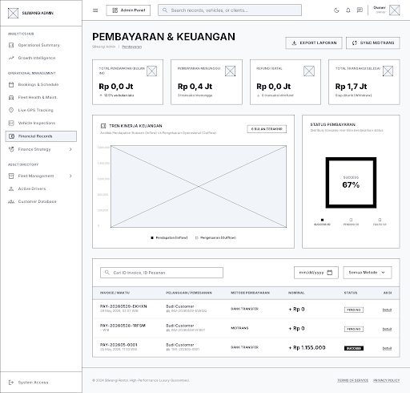

### 20. Rancangan Dashboard Analytics

Fitur visualisasi statistik transaksi, pendapatan, dan penggunaan armada.

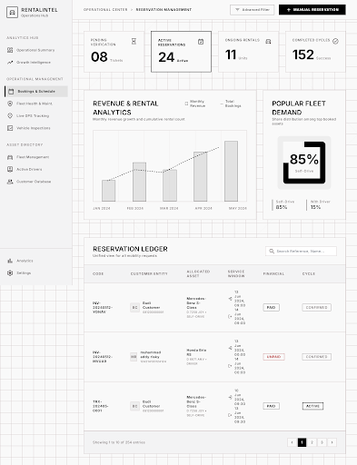

### 21. Rancangan Laporan Penyewaan

Belum ditentukan pada requirement.

### 22. Rancangan Laporan Pembayaran

Belum ditentukan pada requirement.

### 23. Rancangan Laporan Kendaraan

Belum ditentukan pada requirement.

### 24. Rancangan Ekspor Laporan

Belum ditentukan pada requirement.

---

## c. Tampilan Driver

### 1. Rancangan Login Driver

Belum ditentukan pada requirement.

### 2. Rancangan Kelola Jadwal Driver

Belum ditentukan pada requirement.

### 3. Rancangan Detail Penugasan Driver

Belum ditentukan pada requirement.

### 4. Rancangan Input Status Perjalanan

Belum ditentukan pada requirement.

### 5. Rancangan Konfirmasi Penyelesaian Tugas

Belum ditentukan pada requirement.
